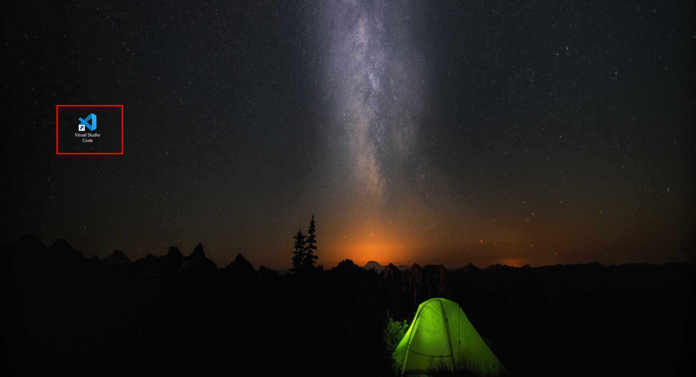

{ width="150"}
# Usemos Visual Studio Code

## Primeros pasos…

## ¿Que es el Front End?

La parte de un sitio web con la que el usuario interactua directamente se denomina interfaz de usuario o simplemente interfaz. Se podría decir que es la parte del cliente de una aplicación. Incluye todo lo que los usuarios experimentan: colores, estilos, imágenes, gráficos, tablas botones, animaciones, etc. 

Para esta parte del desarrollo de software se utilizaran principalmente lenguajes como HTML, CSS y JavaScript. Quien se encarga del *Front End* se encargan de implementar la estructura, diseño, comportamiento y contenido de todo lo que se vera en el navegador por el usuario. Las vistas del *Front End* pueden ser sitios web, aplicaciones web o aplicaciones móviles.

Tal que la capacidad de respuesta y el rendimiento son los objetivos principales de este apartado. Cuando se hace desarrollo de *Front End* se debe probar que el sitio o aplicación responda, que los elementos visuales aparezcan correctamente, y que las funciones se comporten correctamente.

## Interfaz

- Para poder lanzar la aplicación de Visual Studio Code (Visual Code), podremos utilizar dos maneras, la primera de ellas a través del icono que se encuentra en el escritorio.



- Y la segundo sera buscando la aplicación en el menú de inicio.

{ width="500"}

- En cualquiera de los dos casos hacemos doble click y se lanzara nuestra aplicación, desplegándose la pantalla de inicio que es como la que se muestra a continuación.


- En el área de trabajo encontraremos algunas combinaciones para atajos bastante útiles, conforme vayas trabajando en desarrollo de proyectos, entenderás para que se usan estos atajos.

## Personalización

Algo que consideramos importante es que tu experiencia al trabajar en el desarrollo de software sea la mejor, y una parte esencial de esta experiencia es la visualización de la aplicación, por lo que aprovecharemos en esta ocasión para enseñarte rápidamente como se lleva a cabo la personalización del tema del Visual Code.

- Nos dirigimos a la parte inferior izquierda de la pagina de inicio y daremos click en el botón de configuración que es el que se indica en la imagen siguiente.

{ width="500"}

- Hacemos click en la opción *Color Theme* lo cual nos desplegara las opciones de tema que podremos utilizar.


- Se pueden descargar mas temas si es que no te gusta alguno de los preinstalados, solo debemos dar click en la opción *Browse Additional Color Themes…*

{ width="500"}

## Extensiones

Otra de las cosas interesantes que nos ofrece el Visual Code es que podemos agregar complementos de manera muy sencilla y estos nos ayudaran al desarrollo de nuestros proyectos.

Estos complementos se conocen como extensiones y en la barra lateral izquierda podremos ir a una sección donde visualizaremos las extensiones que tenemos instaladas.

{ width="300"}

Ahí también encontraras un buscador donde podrás buscar de manera mas especifica extensiones, ya sea que estén instaladas o que se puedan descargar las veras enlistadas en la barra lateral.

Te recomendamos que instales las siguientes extensiones:

- Color Highlight
    
    Te cambia el fondo de los códigos en hexadecimal que representen un código de color.
    
    
    
- CSS Flexbox Cheatsheet
    
    Esta extensión te permitirá abrir de manera directa una vista de referencia de los estilos usando flexbox, herramienta fundamental para diseño.
    
    
    
- ES7 React/Redux/GraphQL/React-Native snippets
    
    Esta extensión nos ayudara a agregar funciones en todos los proyectos donde se utiliza React, que es una biblioteca de las mas usadas para desarrollo de *Front End*.
    

## Lanzar plataforma

Para poder visualizar el *Front End* debemos de lanzar nuestra plataforma desde Visual Code, para hacer esto primero debemos abrir la carpeta donde se encuentra nuestro proyecto. 

- Y apara esto nos dirigimos al menú superior y buscamos el botón *File,* al dar click en el se desplegaran varias opciones.

{ width="500"}

- Ahora debemos dar click en la opción *Open Folder…,* se nos desplegara una ventana del explorador de archivos, y aqui buscaremos y seleccionaremos la carpeta de nuestro proyecto a lanzar.


- Ya cargado el proyecto nos aparecerá la siguiente pantalla.


- Un paso importante sera instalar el proyecto, y para esto utilizaremos la herramienta npm (si no la tienes instalada puedes verificar como hacerlo [AQUI](../Hola,%20bienvenido%20a%20tu%201er%20di%CC%81a%20c62c76fae62a4fd6a993dd754906543d.md)). Debemos abrir la consola de Visual Code, y para esto nos dirigimos al botón de *View*, y seleccionamos la opción *Terminal.*


- Aparecerá en la parte inferior del área de trabajo una terminal y en la primer linea tendremos la dirección de la carpeta de nuestro proyecto.


- Escribimos lo siguiente:

```powershell
npm install
```

- Debemos esperar a que se instale nuestro proyecto, la manera en que sabremos que ya se completo el proceso es que vuelve a aparecer la ruta de nuestro proyecto como cuando se desplegó la terminal.
- Y ahora si, para poder lanzar nuestro proyecto utilizaremos el siguiente comando.

```powershell
npm start
```

- Se abrirá una nueva pestaña en el navegador que estemos utilizando o en el que tengamos como predeterminado. De esa manera visualizaremos la parte del *Front End* de nuestro proyecto.

<aside>
☝ En caso de que no se inicie correctamente el proyecto te recomendamos acercarte a alguno de tus compañeros o directamente a tu coach, ya que uno de los problemas mas comunes con los que te encontraras sera el versionado.
</aside>


# ¡FELICIDADES HAS CONCLUIDO CON ESTA SECCIÓN!

Si aun no los has revisado checa esta otra documentación…

[Usemos Visual Studio ](Usemos%20Visual%20Studio%20ee10e243d40246b480dced765d9016fb.md)

[Usemos el gestionador de bases de datos.](Usemos%20el%20gestionador%20de%20bases%20de%20datos%20fd9ae6110c8343dea703aaca3985a015.md)