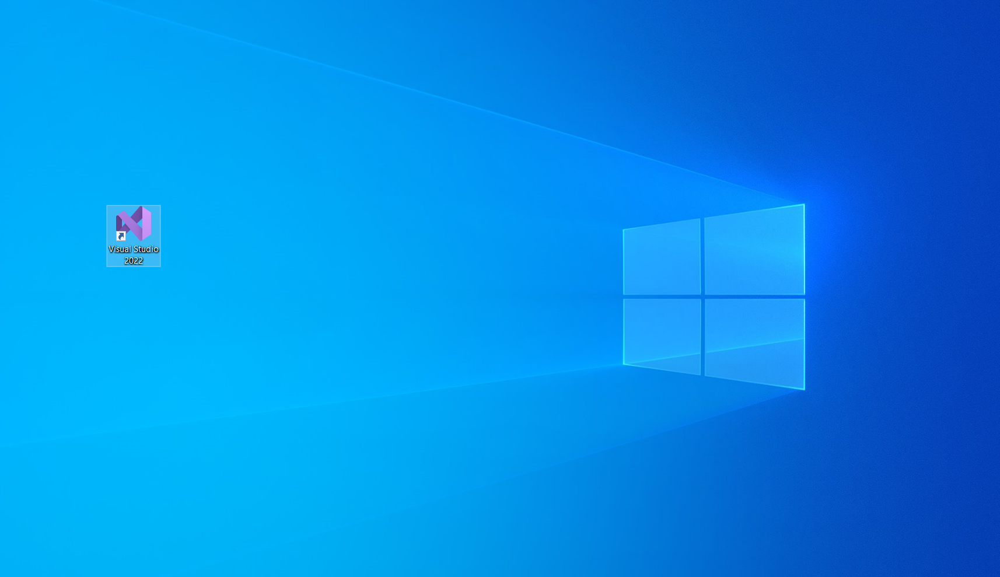

{ width="200"}
# Usemos Visual Studio

## Primeros pasos…

## ¿Que es el Back End?

Cuando hablamos de este concepto en el desarrollo de software nos referimos a un proceso del servidor e incluso hoy día pueden ser procesos que llevan a cabo en la nube. Cuando hacemos desarrollo en el *Back End* hablamos de la recolección, guardado y gestión de la información (bases de datos). Es decir, todo aquello con lo que el usuario no interactúa directamente; Como ejemplo podríamos tomar las APIs (Interfaces de programación de aplicaciones por sus siglas en ingles), las librerías y componentes del sistema.

Visual Studio de Microsoft es una de las plataformas mas usadas en el mundo para desarrollo de software y nos sera de gran ayuda para trabajar el apartado del *Back End* de los proyectos, ya que esta cuenta con varias funcionalidades, entre las que se encuentran el generar código para diferentes lenguajes de programación, compilar, depurar, implementar, analizar y muchas otras cosas mas, por decir algo. Ahora es tu turno de aprender un poco mas de este software para que comiences a incursionar en el desarrollo del *Back End:*

## Interfaz

- Para poder lanzar el Visual Studio daremos doble click en el logo que ahora tenemos en el escritorio.

- O también podemos acceder a el a través del menú de inicio.

{ width="500"}

- Veremos la pantalla de inicio.

{ width="500"}

- Tendremos disponibles las opciones de ***Clonar repositorio***, ***Abrir un proyecto o solución***, ***Abrir una carpeta local***, y ***crear un nuevo proyecto***.

{ width="500"}

- Como apenas vamos empezando, abriremos un proyecto/solución ya existente, y para esto hay dos formas. La primera sera buscar directamente dando click en la opción ***Abrir un proyecto o solución***, lo cual desplegara una ventana del explorador y deberemos buscar nuestro archivo con extensión **.sln:**

- Y por otro lado podemos simplemente ir directamente al archivo en nuestro explorador de archivos y dar doble click para que se lance en el Visual Studio.
- Ya que hemos inicializado el proyecto aparecera la siguiente pantalla, y lo cual representa que ya podemos trabajar en el.

## Como lanzar una webapi desde Visual Studio

Hay diferentes formas de lanzar una webapi desde nuestra plataforma, pero como en esta ocasión solo veremos las dos formas básicas que te ayudaran al desarrollo de software. 

### Ver en un navegador (View/Ver)

Esta es la forma mas sencilla, pero cabe mencionar que si el programa presenta errores no se lanzara.

- Primero debemos ir a la barra lateral derecha, donde se encuentra el explorador del proyecto, ahí buscamos el apartado con extensión *.webapi,* se debe dar click derecho*.*

- Se desplegara el menú de opciones, buscamos y damos click en View/Ver y ahí mismo en la única opción que nos aparecerá.

- Esta acción hará que se abra una pestaña en el navegador que este abierto en ese momento o el predeterminado, la cual corresponderá al puerto de la webapi.

### Por depuración/debugging

- Para lanzar la webapi por este método, de igual manera que en el anterior buscamos y marcamos el apartado con extensión *.webapi.*

- Y la diferencia radicara en que para lanzar el programa haremos click en el botón *IIS Express(´navegador´),* y con esto cambiara el aspecto de nuestra interfaz, ya que en este método de lanzamiento podremos monitorear mas a detalle la ejecución de nuestra webapi.

- También se abrirá una nueva pestaña en el navegador como se menciona en el método anterior.

<aside>
💡 Para poder detener la ejecución de nuestra webapi sera suficiente con cerrar la pestaña que se abre al lanzarla en cualquiera de los métodos explicados.

</aside>

## ¿Donde encuentro el nombre de la base de datos del proyecto?

Una de las situaciones cotidianas con las que te encontraras sera el tener que restaurar la base o bases de datos correspondientes al proyecto que estés desarrollando y para llevar a cabo esta acción sera necesario saber con que nombre el programa que corresponde al *Back End* encuentra dicha o dichas bases de datos, por lo que en este pequeño apartado te diremos como buscar ese nombre. 

- Primero deberás haber abierto el proyecto en cuestión, nos iremos a la barra lateral derecha que corresponde al explorador del proyecto.

- Buscamos el apartado con extensión *.webapi,* y lo desplegamos, ahi encontraremos varios archivos pero para este caso el que nos interesa sera uno llamado *Web.config*.

- Damos doble click sobre el archivo ya mencionado y podremos tener una vista del código que compone dicho archivo, en esta vista deberemos buscar la palabra Database, y para esto tenemos dos opciones, la primera sera buscar directamente linea por linea, mientras que la segunda que por cierto es mucho mas fácil sera simplemente presionando al mismo tiempo
    
    { width="200"}
    
    con eso se desplegara el buscador por palabras de Visual Studio, ingresamos la palabra *Database*.
    
    { width="700"}
    
    Y sabremos cual es la correcta basandonos en el siguiente ejemplo.
    
    
    
- Y listo ese es el nombre que necesitamos, puedes volver a la sección que corresponde a la restauración de bases de datos desde [AQUI.](Usemos%20el%20gestionador%20de%20bases%20de%20datos%20fd9ae6110c8343dea703aaca3985a015.md)

# ¡FELICIDADES HAS CONCLUIDO CON ESTA SECCIÓN!

Si aun no los has revisado checa esta otra documentación…

[Usemos Visual Studio Code](Usemos%20Visual%20Studio%20Code%206523405cead146ed9167afb69b843478.md)

[Usemos el gestionador de bases de datos.](Usemos%20el%20gestionador%20de%20bases%20de%20datos%20fd9ae6110c8343dea703aaca3985a015.md)