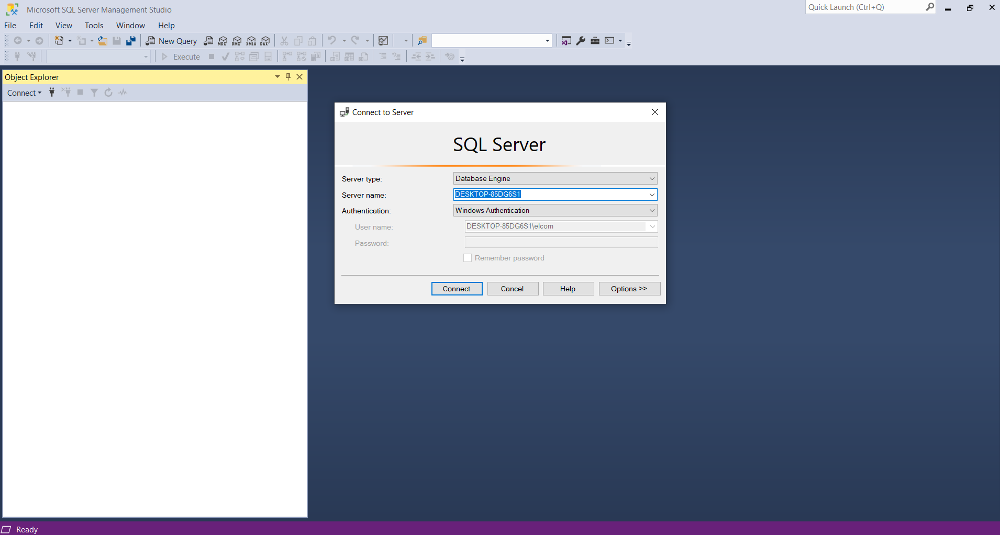

{ width="200"}
# Usemos el gestionador de bases de datos.

## Primeros pasos…

## ¿Que es una base de datos?

Una base de datos  es una recopilación organizada de información o datos estructurados, que para nuestro caso se almacena de forma electrónica. En desarrollo de software son esenciales ya que cualquier plataforma guarda su información en bases de datos, por lo que sera importante usar gestionadores de estas o como se conocen mejor Sistemas de Gestión de Bases de Datos(DBMS). Los datos de los tipos mas comunes de bases de datos en funcionamiento actualmente suelen ser utilizados en estructuras de series de tablas para de poder aumentar la eficacia del procesamiento. Nosotros como empresa a través de un DBMS debemos acceder, gestionar, modificar, actualizar, controlar y organizar fácilmente los datos. Para esto utilizaremos un lenguaje de consulta estructurada (SQL). 

## Motor para la base de datos SQL Developer

Dentro de Apsys utilizamos bases de datos de diversas plataformas desarolladas por nosotros, por lo que sera importante contar con un motor de bases datos, el cual permitira al gestionador llevar a cabo acciones como migraciones, modelado de bases de datos, ejecuciones de scripts y querys, etc. En nuestro caso y de manera estandarizada utilizamos como motor el SQL Developer de oracle. Para poder instalar dicho motor nos dirigiremos al siguiente link: ([Instalar SQL Developer](https://www.oracle.com/database/sqldeveloper/technologies/download/))

## SQL Server Management Studio (SSMS)

Como gestionador de bases de datos utilizaremos este increíble software desarrollado por Microsoft el cual nos ofrece muy buena accesibilidad y funcionalidad para poder crear, respaldar, modificar, etc; nuestras bases de datos. Y como primer paso conoceremos su interfaz y algunas funciones muy básicas, así que no te preocupes si no haz profundizado mucho en temas de bases de datos, con la herramienta que estas a punto de conocer veras la utilidad de utilizarlas y lo accesible que puede ser.

## Interfaz

Para lanzar el SMSS tenemos que buscar en el menu de incio la aplicación, lo encontraremos en la carpeta *Microsoft SQL Tools ‘version’.* 

{ width="500"}

Dando doble click se desplegara la plataforma como se muestra a continuación.

{ width="500"}

Y posteriormente observaremos la vista de inicio.

Tendremos que autenticarnos para poder acceder a las funciones, si tienes dudas con respecto a las credenciales puedes pedir ayuda a alguno de tus compañeros o a directamente a tu coach.

Ya dentro de la aplicación observaremos una barra lateral que nos muestra un explorador, aquí podremos ver diferentes carpetas correspondientes a las bases de datos.

Y en la parte superior nuestra barra de herramientas.

## Restaurar una base de datos

La gran mayoría de las bases de datos que utilizaras al principio se te serán proporcionadas, por lo que en este inicio en el uso del SMSS aprenderemos a realizar una restauración de base de datos.

- Primero deberás tener a tu disposición la base de datos que restauraras, sabrás identificarla por que tienen la extensión *.bak.*

{ width="700"}

- En el SMSS en la carpeta *Databases* daremos click derecho. Y seleccionaremos Restore Database…

{ width="500"}

- Se desplegara la siguiente ventana.

- Seleccionaremos *Device* y daremos click en el botón ‘…’ que nos abrirá una ventana de selección de dispositivos de respaldo(Select backup devices).

- Hacemos click en Add, lo cual nos desplegara una ventana del explorador y deberemos seleccionar el archivo correspondiente a la base de datos que se restaurara.

- Seleccionamos nuestro archivo y procedemos a dar click en el boton *OK.* Ahora en nuestra ventana de dispositivos de seleccion de respaldo aparecera la ruta de nuestro archivo, hacemos click nuevamente en *OK.*

- Veremos como el nombre de nuestro archivo aparece en el apartado Database.

⚠️ Deberás verificar el nombre de la base de datos en el programa correspondiente al *Back End*, como se explica en [AQUI](Usemos%20Visual%20Studio%20ee10e243d40246b480dced765d9016fb.md). Antes de continuar al siguiente paso.

- Si esta base de datos no ha sido restaurada bastara con dar click en *OK* y esperar a que el proceso se complete. En caso contrario ver al paso siguiente.

- Nos vamos a la opcion de la barra lateral llamada *Options,* y se debe marcar la casilla *Overwrite the existing database (WITH REPLACE).*

{ width="700"}

- Y finalizamos haciendo click en el botón *OK*, ya solo quedaría esperar a que finalice el proceso y la base de datos estará restaurada.

# ¡FELICIDADES HAS CONCLUIDO CON ESTA SECCIÓN!

Si aun no los has revisado checa esta otra documentación…

[Usemos Visual Studio ](Usemos%20Visual%20Studio%20ee10e243d40246b480dced765d9016fb.md)

[Usemos Visual Studio Code](Usemos%20Visual%20Studio%20Code%206523405cead146ed9167afb69b843478.md)