{ width="150"}
# Hola, bienvenido a tu 1er día.

👋 Bienvenid@ a tu nuevo trabajo en la familia Apsys! 

## ¿Que necesitas para empezar?

Para este punto ya se te ha proporcionado una computadora, la cual es personal y que sera tu principal herramienta, a continuación encontraras una lista de acciones que revisaremos para tener tu pc a punto: 

<aside>
💡 Es importante seguir en orden los pasos de la lista, ya que de lo contrario se puede afectar la instalación o acceso a los recursos necesarios para completar este proceso.

</aside>

- [x] La computadora se encuentra formateada y con configuración de fabrica ([¿Como formateo mi pc?](https://support.microsoft.com/es-es/windows/realizar-un-comienzo-de-cero-en-el-pc-0ef73740-b927-549b-b7c9-e6f2b48d275e#:~:text=Para%20restablecer%20el%20equipo%2C%20ve%20a%20Inicio%20%3E%20Configuraci%C3%B3n%20%3E%20Actualizaci%C3%B3n,establece%20%C2%BFRestaurar%20las%20aplicaciones%20preinstaladas%3F)).
- [x] Ya instale el navegador de mi preferencia ([Chrome](https://www.google.com/intl/es_mx/chrome/), [Firefox](https://www.mozilla.org/es-MX/firefox/new/), [Opera](https://www.opera.com/es/gx), etc).
- [x] Ya dispongo de mi nuevo correo empresarial ([¿Como lo obtengo?](Hola,%20bienvenido%20a%20tu%201er%20di%CC%81a%20c62c76fae62a4fd6a993dd754906543d.md)).
- [x] Descargue e instale [Slack](https://slack.com/intl/es-mx), (es importante hacer registro).
- [x] Descargue e instale [LightShot](https://app.prntscr.com/es/).
- [x] Descargue e instale [Postman](https://www.postman.com/), (es importante hacer registro).
- [x] Descargue e instale Cisco AnyConnect.
- [x] Descargue e instale [GIT](https://git-scm.com/).
- [x] Descargue e instale [TortoiseGit](https://tortoisegit.org/).
- [x] [Descargue](https://learn.microsoft.com/en-us/sql/ssms/download-sql-server-management-studio-ssms?view=sql-server-ver16#:~:text=in%20the%20cloud.-,Download%20SSMS,-To%20download%20SSMS) e [instale](Hola,%20bienvenido%20a%20tu%201er%20di%CC%81a%20c62c76fae62a4fd6a993dd754906543d.md) el Microsoft SQL Server Management Studio (developer).
- [x] [Descargue](https://visualstudio.microsoft.com/es/) e [instale](Hola,%20bienvenido%20a%20tu%201er%20di%CC%81a%20c62c76fae62a4fd6a993dd754906543d.md) Visual Studio Community.
- [x] [Descargue](https://code.visualstudio.com/?wt.mc_id=DX_841432) e [instale](Hola,%20bienvenido%20a%20tu%201er%20di%CC%81a%20c62c76fae62a4fd6a993dd754906543d.md) Visual Studio Code.
- [x] [Instale](Hola,%20bienvenido%20a%20tu%201er%20di%CC%81a%20c62c76fae62a4fd6a993dd754906543d.md) node.js desde una interfaz de linea de comandos.

## Instalar Microsoft SQL Server Management Studio.

Para instalar esta aplicación deberemos haber descargado el SSMS-Setup-ENU.exe, sino [aquí](https://learn.microsoft.com/en-us/sql/ssms/download-sql-server-management-studio-ssms?view=sql-server-ver16) también puedes realizar la descarga. 

- Abrimos el ejecutable y podremos observar la siguiente ventana.

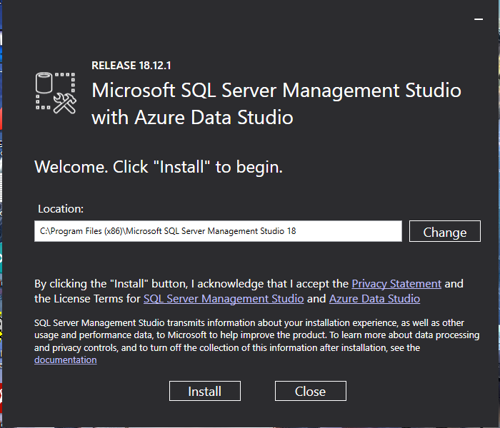

- Podremos ver la ubicación (ruta), donde se instalara el software, esta puede ser cambiada pero se recomienda dejar la que nos da por defecto. Procedemos a dar click en *Install,* y se comenzaran a cargar los paquetes como muestra la siguiente pantalla*.*

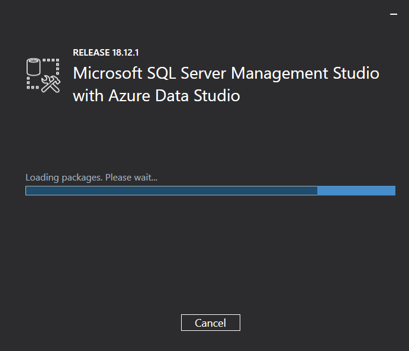

- Se comenzaran a instalar los diferentes paquetes, en ocasiones por cuestiones de configuración nos aparecerá el error siguiente:

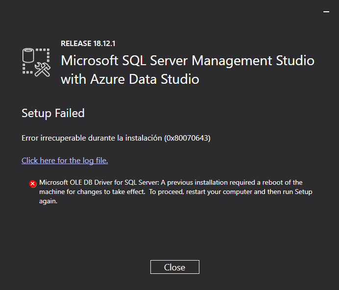

- Para solucionarlo, bastara con reiniciar tu computadora y volver a realizar los pasos anteriores. Si ya no aparece este problema veremos como se lleva a cabo la instalación de los paquetes y la barra *Overall Progress* se completara.

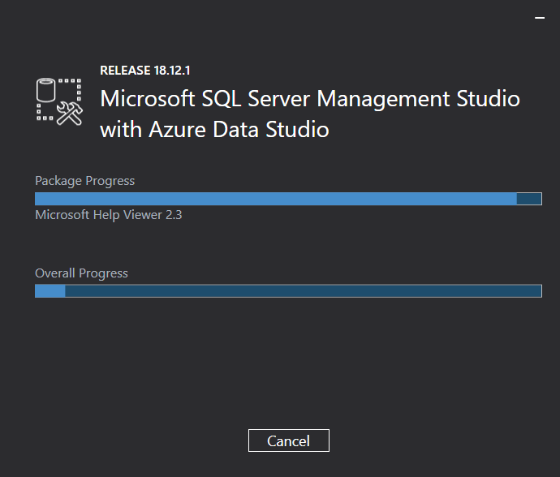

- Al terminar nos mostrara una pantalla que confirma la correcta instalación y con el botón *Close* podremos cerrar el instalador.

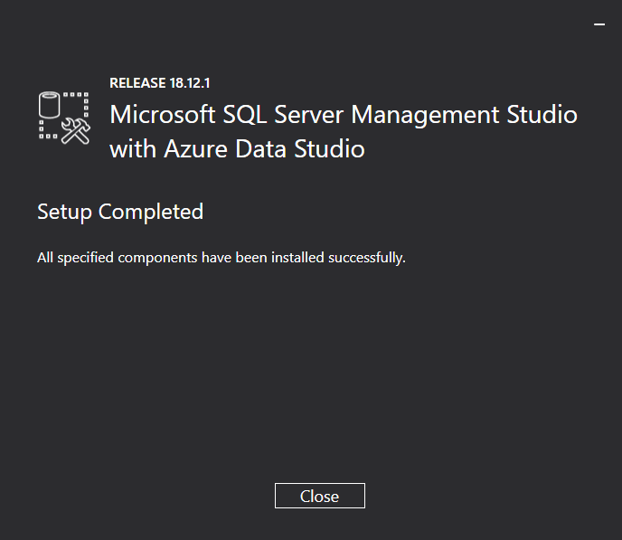

> Si quieres aprender un poco mas de esta herramienta y realizar un par de acciones que te serán de ayuda para los proyectos que te esperan da click **[AQUI](Usemos%20el%20gestionador%20de%20bases%20de%20datos%20fd9ae6110c8343dea703aaca3985a015.md)**.
> 

## Instalar Visual Studio Community.

Para comenzar con la instalación del Visual Studio sera necesario haber descargado el VisualStudioSetup.exe, en caso de aun no tenerlo puedes descargarlo [aquí](https://visualstudio.microsoft.com/es/). 

- Ya teniendo nuestro programa instalador el siguiente paso entonces sera da doble click a dicho programa. Se desplegara la ventana de confirmación para ejecutar el archivo, así como se muestra en la siguiente imagen.

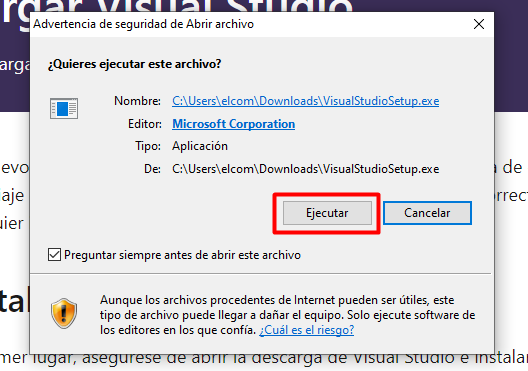

- Al hacer click en *Ejecutar* pasaremos **a una ventana informativa donde Visual Studio nos dice que llevara a cabo algunas configuraciones previas a la instalación*.*

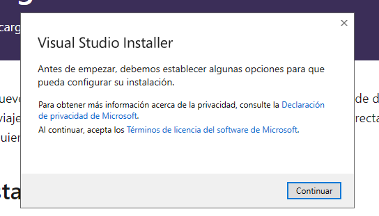

- Deberemos dar click al botón de continuar y posteriormente se descargaran algunos archivos que iniciaran ahora si el instalador de Visual Studio.

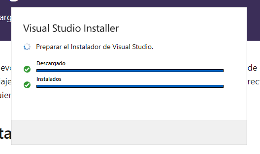

- La ventana del instalador se vera de la siguiente manera:

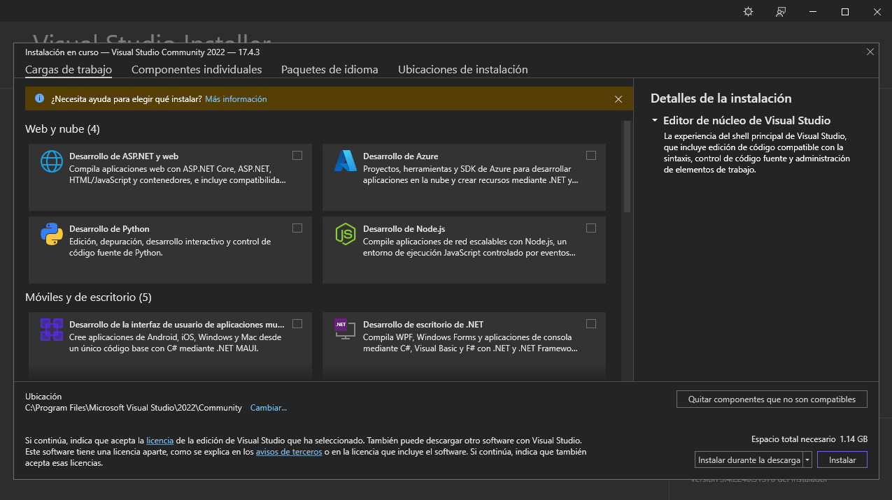

- Y aquí lo importante sera configurar la instalación de nuestro Visual Studio para tener todos los complementos necesarios y así aprovechar al máximo este software. Tenemos 4 pestañas de opciones de configuración: ***Cargas de trabajo, Componentes individuales, Paquetes de idioma y Ubicaciones de instalación.***

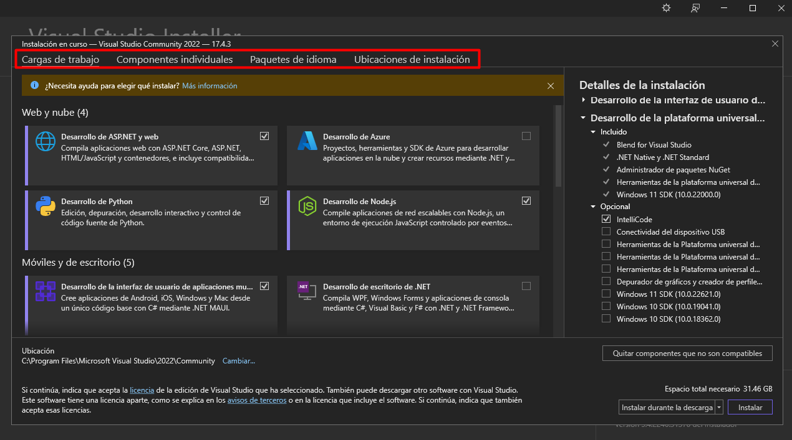

- A continuación encontraras las opciones que deberás marcar en cada pestaña de configuración.
- **Cargas de trabajo.**
    - Desarrollo de ASP.NET y web.
        
        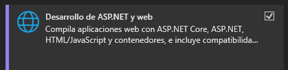

    - Desarrollo de Python.
        
        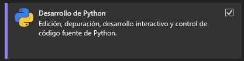
        
    - Desarrollo de Node.js.
        
        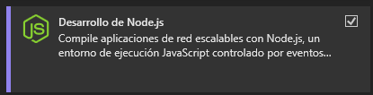
        
    - Desarrollo de la interfaz de usuario de aplicaciones multiplataforma de .NET.
        
        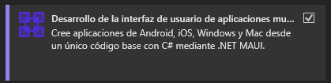
        
    - Desarrollo de la plataforma universal de Windows.
        
        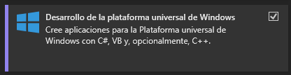
        
    - Almacenamiento y procesamiento de datos.
        
        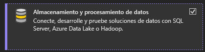
        
- **Componentes individuales.**
    - .NET 6.0 Runtime (Long Term Support).
    - .NET 7.0 Runtime.
    - .NET Core 3.1 Runtime (Long Term Support).
    - .NET MAUI SDK for Android.
    - .NET MAUI SDK for iOS.
    - .NET MAUI SDK For Mac Catalyst.
    - .NET MAUI SDK For Windows.
    - .NET Native.
    - .NET SDK for Android.
    - .NET SDK for iOS.
    - .NET WebAssembly for Mac Catalyst.
    - Paquete de compatibilidad de .NET Framework 4.7.2.
    - Paquete de compatibilidad de .NET Framework 4.8.
    - Plantillas de proyecto y de elemento de .NET Framework.
    - SDK de .NET.
    - SDK de .NET Framework 4.8.
    
    <aside>
    ☝ Las opciones de los demás apartados de los ***Componentes individuales*** se deberán mantener con la configuración por defecto.
    
    </aside>
    
- **Paquetes de idiomas.**
    - English.
    - Español.
    
    <aside>
    ☝ Si bien estos idiomas son lo que se sugieren, es posible agregar cualquier otro de la lista bajo la premisa de que se domine bien el idioma seleccionado.
    
    </aside>
    
- **Ubicación de instalación.**
    - La configuración de este apartado puede ser la que esta por defecto, pero en caso de tener mas de un HDD o SSD, se puede seleccionar una ruta personalizada, todo esto con el fin de optimizar la memoria de almacenamiento disponible.

- Ya que hemos conlcuido con las opciones de configuración podemos proceder a dar click en el boton de Instalar, dejando la opción de *Instalar durante la descarga* que esta por defecto.

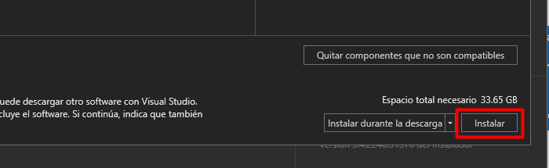

- Aparecerá una pantalla que nos muestra el porcentaje de descarga y el estatus de los paquetes instalados.

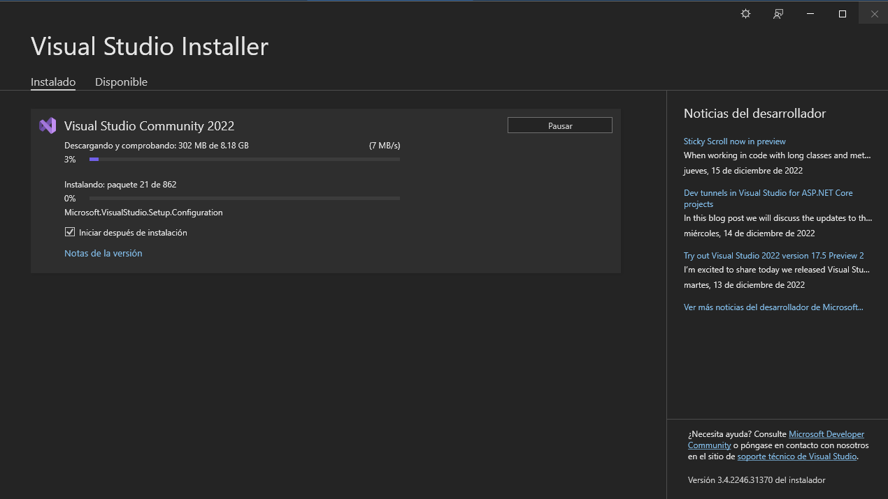

<aside>
⚠️ Lo mejor sera esperar a que se termine esta instalación, conecta tu computadora con su cable de alimentación y te recomendamos no instalar otro software mientras este proceso se lleva a cabo.

</aside>

- Terminada la instalación tendremos acceso a tres nuevos botones, ***Modificar***, ***Iniciar*** y ***Más.*** El primero nos servirá para cambiar las configuraciones de instalación que ya revisamos durante la instalación, el segundo lanzara el programa de Visual Studio y el último nos permitirá tener acceso a algunas herramientas relacionadas con la instalación.

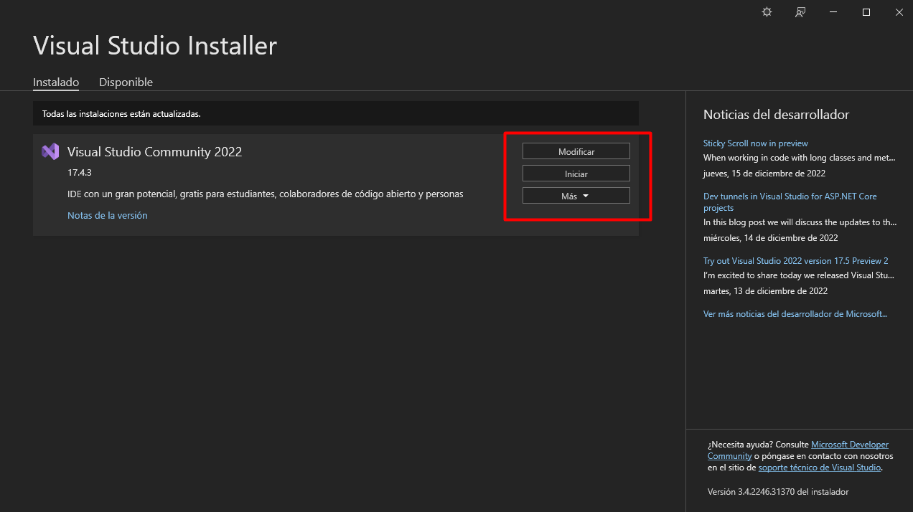

> Ahora que cuentas con esta gran herramienta ¿No te gustaría dar tus primeros pasos usándola?, atrévete a explorarla y conocer algunas funciones básicas que tiene para ti dando click [AQUI](Usemos%20Visual%20Studio%20ee10e243d40246b480dced765d9016fb.md).
> 

## Instalar Visual Studio Code.

Si ya has descargado el archivo VSCodeUserSetup-x64-1.74.1 pasaremos a la etapa de instalación, de lo contrario descarga [aquí](https://code.visualstudio.com/). 

- Daremos doble click al programa de instalación ya mencionado y nos aparecerá la ventana de confirmación para ejecutar a instalación, damos click en *Ejecutar.*

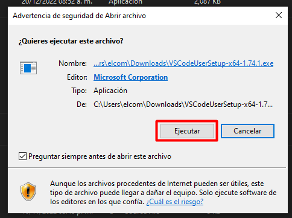

- Ahora veremos el *Acuerdo de Licencia,* se sugiere leerlo y posteriormente cambiar a la opción Acepto el acuerdo situada en la parte inferior de la ventana*.* Y damos siguiente*.*

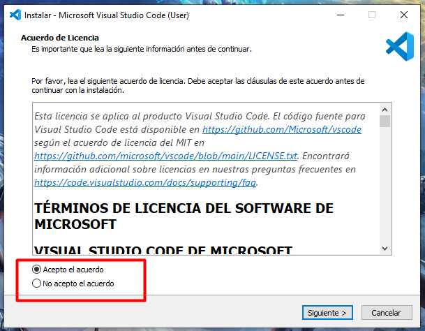

- En la siguiente ventana debemos seleccionar la carpeta de destino, se puede dejar la que se muestra por defecto, pero esto dependerá si es que tenemos mas de un medio de almacenamiento (HDD o SDD), ya que esto sera de importancia para optimizar la memoria. Después de realizar la selección volvemos a dar click en siguiente.

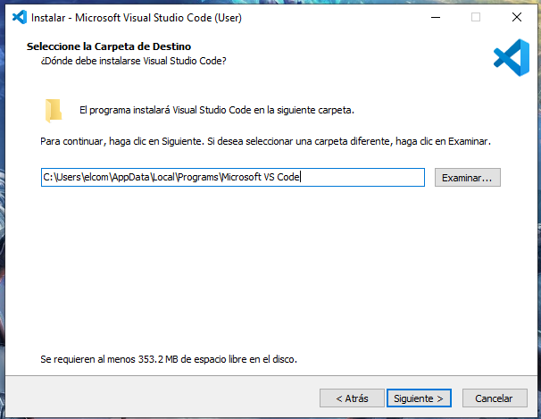

- Nuevamente nos aparece una selección, en este caso la de la carpeta del menú de inicio. Se recomienda dejar la que esta por defecto. Y se da click en siguiente.

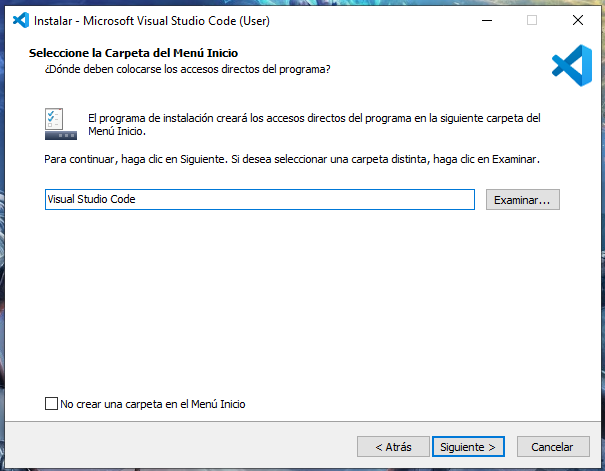

- Se muestran opciones de para la selección de las tareas adicionales. Se deben marcar las que se muestran en la imagen. Y como en los pasos anteriores damos nuevamente a siguiente.

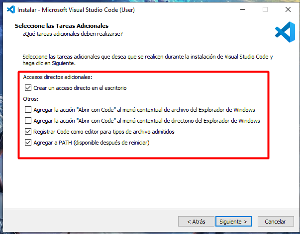

- Y ahora estamos listos para instalar, solo queda ir al botón de Instalar y permitimos que se realice esta acción.

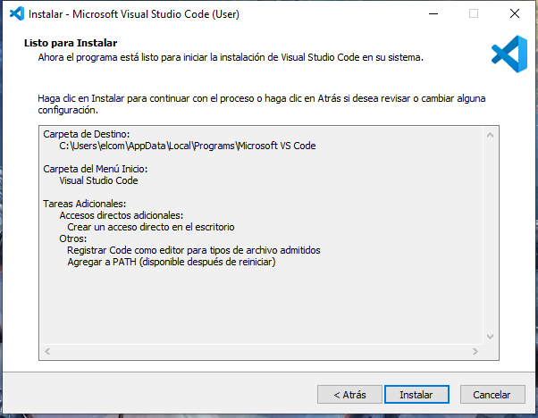

<aside>
⚠️ Lo mejor sera esperar a que se termine esta instalación, conecta tu computadora con su cable de alimentación y te recomendamos no instalar otro software mientras este proceso se lleva a cabo.

</aside>

- Y listo tu software esta instalado, puedes lanzarlo dejando la opción de *Ejecutar Visual Studio Code* y haciendo click en *Finalizar*, o a través de los accesos directos que se mencionan en el apartado [Usemos Visual Studio Code](Usemos%20Visual%20Studio%20Code%206523405cead146ed9167afb69b843478.md).


> Es hora de que conozcas mas a fondo esta increíble aplicación, da click [AQUI](Usemos%20Visual%20Studio%20Code%206523405cead146ed9167afb69b843478.md) para mas información.
> 

## **Obtener correo personal Apsys.**

Para poder tener tu correo personal e único que te identificara dentro de Apsys, deberás ponerte en contacto con @oscar_sanchez, a través de [correo](mailto:oscar.sanchez@apsys.mx) electrónico.

## **Como instalamos node.js**

Es esencial el uso de herramientas como las interfaces de linea de comandos o consolas como se conocen comúnmente. Y para el caso de la instalación del complemento node.js tendremos que recurrir al uso de alguna de las herramientas ya mencionadas. Se sugiere utilizar la herramienta símbolo del sistema, la cual ya esta integrada en el sistema operativo windows, por lo que no debería haber mayor problema para poder ejecutarlo.

- Antes de todo instalaremos en Node Version Manager(nvm), siguiendo los pasos descritos [aqui](https://midu.dev/como-instalar-node-en-mac-y-windows/#:~:text=en%20diferentes%20proyectos.-,%C2%BFQu%C3%A9%20es%20nvm%3F,-nvm%20es%20un).
- Presionamos al mismo tiempo en nuestro teclado la tecla **windows y r**, se desplegara la aplicación Ejecutar.
    
    { width="120"}
    
- Escribimos cmd en la aplicación Ejecutar y damos enter.
    
    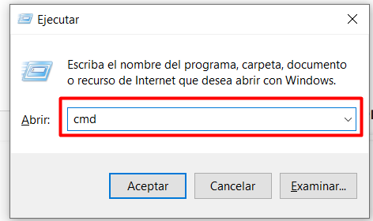
    
- Aparecerá la ventana de la interfaz de linea de comando (”símbolo del sistema”).

<aside>
💡 Es importante verificar que el símbolo del sistema se este ejecutando como Administrador.

</aside>

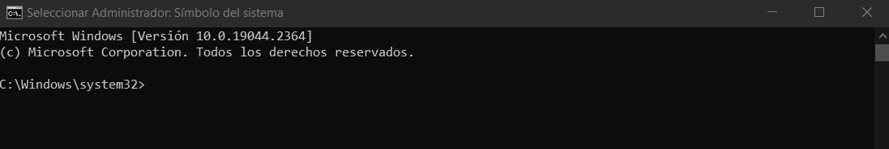

- Verificamos la disponibilidad de versiones en la [documentación](https://nodejs.org/en/) de node.js y escribimos en la consola.

```powershell
[server]$ nvm install v'aqui va la version'
```

- Posterior a la instalación establecemos la versión de node.js que se utilizara.

```powershell
[server]$ nvm use v'versión del node.js'
Now using node v'versión del node.js' (npm v)
```

- Comprobamos la versión de node.js que se esta ejecutando ingresando la siguiente linea:

```powershell
[server]$ node -v
v'versión del node.js'
```

- Por último deberemos verificar y/o instalar el Node Package Manager(npm), para esto escribiremos en la consola lo siguiente:

```powershell
[server]$ npm install -g npm
```

- Y de manera similar como con el node.js, revisamos la versión del npm con el siguiente comando:


```powershell
[server]$ npm -v
```

<aside>
☝ Es muy recomendable que cada que te integres o inicies algún proyecto verifiques que versión de node y npm se requiere, pregúntale a tu coach o compañeros de proyecto si tienes dudas.

</aside>

> Si te gustaría saber mas de la herramienta node.js y sus complementos visita su sitio [nodejs.org](http://nodejs.org/).
> 

[Usemos Visual Studio Code](Usemos%20Visual%20Studio%20Code%206523405cead146ed9167afb69b843478.md)
    
[Usemos Visual Studio ](Usemos%20Visual%20Studio%20ee10e243d40246b480dced765d9016fb.md)
    
[Usemos el gestionador de bases de datos.](Usemos%20el%20gestionador%20de%20bases%20de%20datos%20fd9ae6110c8343dea703aaca3985a015.md)

👉**Tienes preguntas?** Ponte en contacto con alguno de tus compañeros a través de los medios que se te han proporcionado.