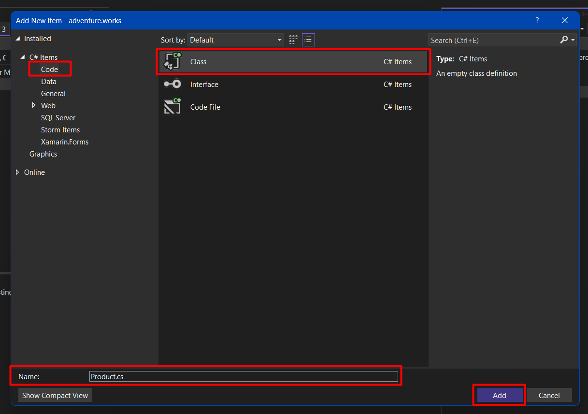

## ** 1er proyecto con una plantilla**

Dentro de Apsys y como busqueda de la mejora continua, hemos creado algunas plantillas, esto con el fiel objetivo de estandarizar nuestros procesos para el desarrollo del software.
Y como primer ejercicio tendras la tarea de generar un indice básico utilizando una plantilla y siguiendo las instrucciones que encontraras a continuación.

### **Configuración**

Deberas abrir el software Visual Studio, usea la plantilla de Apsys que instalamos previamente y con ella crearemos un nuevo
proyecto llamado apsys.pokedex

.png)

Hay que descargar el respaldo de la base de datos por medio del siguiente link: [Pokedex DB](PokedexDB.zip "download")

Tambien iniciaremos el Microsoft SQL Management Studio y crearemos una nueva base de datos con el nombre *pokedex.devel*.


.png)

Restauramos el respaldo a la base de datos que creamos.


.png)

.png)

La selección de la ruta depende de la carpeta en donde se guardo el respaldo de la base de datos que descargaste, en este ejemplo se guardo en la siguiente ruta:

```
C:\Program Files\Microsoft SQL Server\MSSQL15.MSSQLSERVER\MSSQL\Backup
```

.png)

Posteriormente verificamos que la base de datos contenga las siguientes tablas:

.png)

Hasta este punto hemos finalizado con la configuración para la base de datos de nuestro proyecto por lo que seguiremos trabajando nuevamente en Visual Studio.

Crearemos un *endpoint* que obtenga la lista de pokemons, para implementar esta funcionalidad revisaremos la estructura de nuestra solución en Visual Studio.


Nos situamos en el explorador de la solución donde se denotan cuatro capas **dominio**(*01.domain*), **datos**(*02.data*), **servicios**(*03.services*), **webapi**(*webapi*). Se deduce que cada uno tiene diferente funcion dentro del proyecto global que estamos desarrollando. 

!!! Nota
    Notese que en cada capa hay un proyecto con la terminación *testing*, estos son proyectos para realizar pruebas automatizadas y que son de gran importancia, pero para este tutorial no los usaremos ya que nos centraremos en poner en marcha nuestro primer proyecto.

La primera capa que trabajaremos sera la que corresponde al dominio. 

Como siguiente paso agregaremos las clases que usaremos para la lógica de nuestra aplicación. La primera de ellas sera la clase que va a representar un producto de la aplicación y dicha clase la nombraremos *Pokemon*.




El codigo que colocaremos dentro de la clase *Pokemon* sera el siguiente:

```ruby 
namespace apsys.pokedex
{
    public class Pokemon : AbstractDomainObject
    {
        public virtual string Code { get; set; }
        public virtual string Name { get; set; }
    }
}

```

Por el momento solo agregaremos este bloque de codigo en la clase, continuamos en el siguiente paso.

Lo siguiente sera trabajar en nuestra capa de datos. Primero crearemos la interfaz del repositorio que se relaciona con la tabla de pokemons en la base de datos, en el proyecto de
repositorios agregamos una nueva interfaz llamada *IPokemonsRepository*.


Se debe de insertar el siguinete codigo en la interfaz *IPokemonsRepository*

```ruby
using apsys.pokedex;

namespace apsys.pokedex.repositories
{
    public interface IPokemonsRepository : IRepository<Pokemon>
    {
    }
}

```

Siendo que la interfaz mencionada solo define el contrato del repositorio ahora debemos crear una clase que implemente este repositorio, dicha clase la vamos a agregar en
el proyecto de repositorios para *NHibernate* (el proceso a seguir para agregar una clase es el mismo que anteriormente presentamos en este tutorial con la clase *Pokemon*), 
agregamos la clase *PokemonsRepository*


El codigo a insertar en la clase *PokemonsRepository* es el siguiente:

```ruby 
using apsys.pokedex;
using NHibernate;

namespace apsys.pokedex.repositories.nhibernate
{
    public class PokemonsRepository : Repository<Pokemon>, IPokemonsRepository
    {
        public PokemonsRepository(ISession session) 
            : base(session)
        {
        }
    }
}

```

A continuación agregamos el repositorio de pokemons en la unidad de trabajo, para ello abrimos la interfaz *IUnitOfWork* que se encuentra en el proyecto de repositorios.
En esta interfaz agregamos una linea de codigo para definir el repositorio de pokemons.


Tambien debemos modificar la calse que implementa la interface de la unidad de trabajo, abrimos la clase *UnitOfWork*. En esta clase vamos a agregar dos lineas de codigo como se 
puede ver en la siguiente imagen.


Posteriormente configuraremos el mapeo de nuestra API, para relacionar la clase *Pokemon* del dominio con la tabla ```[dbo].[Pokemon]``` de la base de datos, agregamos una nueva 
llamada *PokemonMapper* en la carpeta *mappers* del proyecto de repositorios de *NHibernate*.


El codigo a insertar para la clase *PokemonMapper* sera:

```ruby

using NHibernate.Mapping.ByCode;
using NHibernate.Mapping.ByCode.Conformist;

namespace apsys.pokedex.repositories.nhibernate.mappers
{
    public class PokemonMapper : ClassMapping<Pokemon>
    {
        public PokemonMapper()
        {
            Table("Pokemons");
            Id(x => x.Id, x =>
            {
                x.Generator(Generators.Assigned);
                x.Column("Id");
            });
            Property(b => b.Code, x => { x.Column("Code"); });
            Property(b => b.Name, x => { x.Column("Name"); });
        }
    }
}

```

Hasta este punto hemos finalizado con la etapa que corresponde a los datos de nuestra API, por lo que pasaremos a la capa de servicios. Agregamos una clase
llamada *PokemonsSearcher*, que se encargara de realizar la busqueda de pokemons en la base de datos, esta clase la agregaremos en el proyecto ```apsys.pokedex.services```


El codigo de nuestra clase *PokemonsSearcher* es el siguiente:

```ruby
using apsys.dynamic.filters;
using apsys.pokedex.repositories;
using MediatR;

namespace apsys.pokedex.services
{
    public static class PokemonsSearcher
    {
        public static Query CreateCommand(string queryString)
            => new Query(queryString);

        /// <summary>
        /// Command class
        /// </summary>
        public class Query : SearchQuery, IRequest<ISearchResult<Pokemon>>
        {
            public Query(string queryString)
            {
                QueryString = queryString;
            }
        }

        public class Handler : IRequestHandler<Query, ISearchResult<Pokemon>>
        {
            private readonly IUnitOfWork _unitOfWork;

            /// <summary>
            /// Constructor
            /// </summary>
            /// <param name="uoW"></param>
            /// <param name="pipeline"></param>
            public Handler(IUnitOfWork uoW)
            {
                _unitOfWork = uoW;
            }

            public Task<ISearchResult<Pokemon>> Handle(Query request, CancellationToken cancellationToken)
            {
                QueryStringParser queryStringParser = new QueryStringParser(request.QueryString);
                int pageNumber = queryStringParser.ParsePageNumber();
                int pageSize = queryStringParser.ParsePageSize();
                Sorting sorting = queryStringParser.ParseSorting<Pokemon>(nameof(Pokemon.Name));
                SortingCriteria sortingCriteria = new SortingCriteria(sorting.By, sorting.Direction == "desc" ? SortingCriteriaType.Descending : SortingCriteriaType.Ascending);
                var filters = queryStringParser.ParseFilterOperators<Pokemon>();
                var expression = FilterExpressionParser.ParsePredicate<Pokemon>(filters);
                var allTimesheets = _unitOfWork.Pokemons.Get(expression, pageNumber, pageSize, sortingCriteria);
                var total = _unitOfWork.Pokemons.Count(expression);
                ISearchResult<Pokemon> result = new SearchResult<Pokemon>(total, pageNumber, pageSize, sorting, allTimesheets);
                result.Items = allTimesheets;
                result.Total = total;
                result.PageNumber = pageNumber;
                result.PageSize = pageSize;
                return Task.FromResult(result);
            }
        }
    }
}
```

Al agregar el código anterior el IDE nos mostrara algunos errores, para hacer la correción de dichos errores, agregaremos una referencia al proyecto de servicios, tal como se muestra en la 
siguiente imagen.


Para el último tramo de este tutorial trabajaremos en la capa correspondiente a la *webapi* para codificar el  *endpoint* que nos permitira obtener los datos de los pokemons.
Iniciamos creando el controlador *PokemonsController* en la carpeta de controladores del proyecto ```apsys.pokedex.webapi```


El codigo para el controlador *PokemonsController* es el siguiente:

```ruby
using apsys.pokedex.services;
using MediatR;
using Microsoft.AspNetCore.Mvc;

namespace apsys.pokedex.webapi.Controllers
{
    [ApiController]
    [Route("[controller]")]
    public class PokemonsController : WebApiControllerBase
    {
        public PokemonsController(ILogger<WebApiControllerBase> logger, IMediator mediator, IWebHostEnvironment webHostEnvironment)
            : base(logger, mediator, webHostEnvironment)
        {
        }

        [HttpGet, Route("")]
        public async Task<IActionResult> Search()
        {
            try
            {
                string queryString = HttpContext.Request.QueryString.Value;
                var command = new PokemonsSearcher.Query(queryString);
                var result = await _mediator.Send(command);
                return Ok(result);
            }
            catch (Exception ex)
            {
                this._logger.LogError(ex, "Error getting pokemons");
                return BadRequest(ex);
            }
        }
    }
}

```
Por último modificaremos la cadena de conexión para nuestra base de datos con la webapi.


Para probar que nuestro *endpoint* este funcionando correctamente ejecutaremos la aplicación y podemos usar un cliente como el software *Postman*
o alguna extensión de *VSCode*, como lo son *Thunder cliente* o *RapidApiClient* y hacer la solicitud de la API como se muestra en la siguiente imagen,  considera que es probable que el puerto sea diferente al que se muestra en la imagén.


