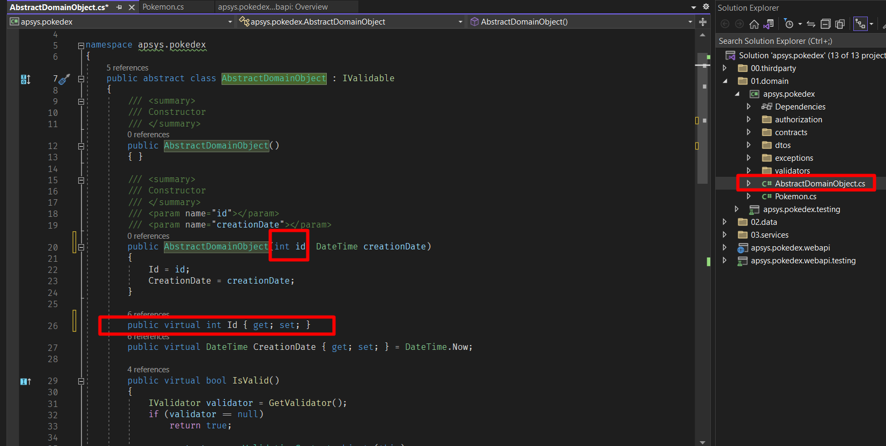

## ** 1er proyecto con una plantilla**

Dentro de Apsys y como busqueda de la mejora continua, hemos creado algunas plantillas, esto con el fiel objetivo de estandarizar nuestros procesos para el desarrollo del software.
Y como primer ejercicio tendras la tarea de generar un indice básico utilizando una plantilla y siguiendo las instrucciones que encontraras a continuación.

### **Configuración**

Deberas abrir el software Visual Studio, usea la plantilla de Apsys que instalamos previamente y con ella crearemos un nuevo
proyecto llamado apsys.pokedex


Hay que descargar el respaldo de la base de datos por medio del siguiente link: [Pokedex DB](pokedex.bak "download")

Tambien iniciaremos el Microsoft SQL Management Studio y crearemos una nueva base de datos con el nombre *pokedex.devel*.


.png)

Restauramos el respaldo a la base de datos que creamos.


.png)

.png)

La selección de la ruta depende de la carpeta en donde se guardo el respaldo de la base de datos que descargaste, en este ejemplo se guardo en la siguiente ruta:

```
C:\Program Files\Microsoft SQL Server\MSSQL15.MSSQLSERVER\MSSQL\Backup
```

.png)

Posteriormente verificamos que la base de datos contenga las siguientes tablas:

.png)

Hasta este punto hemos finalizado con la configuración para la base de datos de nuestro proyecto por lo que seguiremos trabajando nuevamente en Visual Studio.

Crearemos un *endpoint* que obtenga la lista de pokemons, para implementar esta funcionalidad revisaremos la estructura de nuestra solución en Visual Studio.


Nos situamos en el explorador de la solución donde se denotan cuatro capas **dominio**(*01.domain*), **datos**(*02.data*), **servicios**(*03.services*), **webapi**(*webapi*). Se deduce que cada uno tiene diferente funcion dentro del proyecto global que estamos desarrollando. 

!!! Nota
    Notese que en cada capa hay un proyecto con la terminación *testing*, estos son proyectos para realizar pruebas automatizadas y que son de gran importancia, pero para este tutorial no los usaremos ya que nos centraremos en poner en marcha nuestro primer proyecto.

La primera capa que trabajaremos sera la que corresponde al dominio. 


Como siguiente paso agregaremos las clases que usaremos para lalógica de nuestra aplicación. La primera de ellas sera la clase que va a representar un producto de la aplicación y dicha clase la nombraremos *Pokemon*.


El codigo que colocaremos dentro de la clase creada sera el siguiente:

```ruby linenums="1"
namespace apsys.pokedex.products
{
    public class Pokemon : AbstractDomainObject
    {
        public virtual string Code { get; set; }
        public virtual string Name { get; set; }
    }
}

```

Debido a que el *id* del pokemon es un entero en la base de datos vamos a modificar la clase AbstractDomainObject para quede de la siguiente manera:



Por el momento solo agregaremos este bloque de codigo en la clase, ya que para este punto nuestro objetivo es configurar la conexión con nuestra base de datos.

Como siguiente paso debemos trabajar en la capa de datos y para ello primeramente haremos algunos cambios en la conexión a la base de datos. Se abre el archivo *runmigrations.bat* y *rollback.bat*

.png)

En ambos archivos vamos a editar el nombre del ejecutable y de la base de datos de la siguiente manera:
*runmigrations.bat*


*rollback.bat*


Buscaremos el archivo *runmigrations.bat* en el explorador de archivos y lo ejecutamos, al hacerlo se crearan algunas tablas adicionales en la base de datos.

!!!nota
    Por el momento no usaremos estas tablas, sin embargo son necesarias para poder terminar el tutorial. 

El resultado de la ejecución será alfo similar a lo que se muestra en la siguiente imagen:


Ahora crearemos la interfaz del repositorio que se ralaciona con la tabla de productos en la base de datos, en el proyecto de repositorios agregamos una nueva interfaz llamada *IProductsRepository*


```ruby
using adventure.works.products;

namespace adventure.works.repositories
{
    public interface IProductsRepository : IRepository<Product>
    {
    }
}
```

Siendo que la interfaz anterior solo define el contrato del repositorio ahora debemos crear una clase que implemente este repositorio, dicha clase la vamos a agregar en el proyecto de repositorios para Nhibernate.

!!!info
    El proceso a seguir para agregar una clase es el mismo que anteriormente se expuso con la clase *Producto*

Agregamos la clase *ProductRepository*


El código de la clase *ProductRepository* es el siguiente:

```ruby
using adventure.works.products;
using NHibernate;

namespace adventure.works.repositories.nhibernate
{
    public class ProductRepository : Repository<Product>, IProductsRepository
    {
        public ProductRepository(ISession session) 
            : base(session)
        {
        }
    }
}

```

Posteriormente agregamos el repositorio de produtos en la unidad de trabajo, para poder realizar esto abrimos la interfaz *IUnitOfWork* que se encuentra en el proyecto de repositorios.
<!-- Img24 -->
En esta interfaz agregaremos la linea de código siguiente, la cual define el repositorio de productos.
<!-- # Img25 -->
Por otra parte también deberemos modificar la clase que implementa la interfaz de la unidad de trabajo, tal que ahora vamos a abrir la clase *UnitOfWork*
<!-- # Img26 -->
En esta clase agregaremos dos lineas de código tal como se puede observar en la siguiente imagen:
<!-- # Img27 -->
Hay que configura el mapeo para relacionar la clase *Product* del dominio con la tabla ```[SalesLT].[Product]``` de la base de datos, agregamos una nueva clase llamada *ProductMapper* en la carpeta *mappers* del proyecto de repositorios de *NHibernate*.
<!-- # Img28 -->

