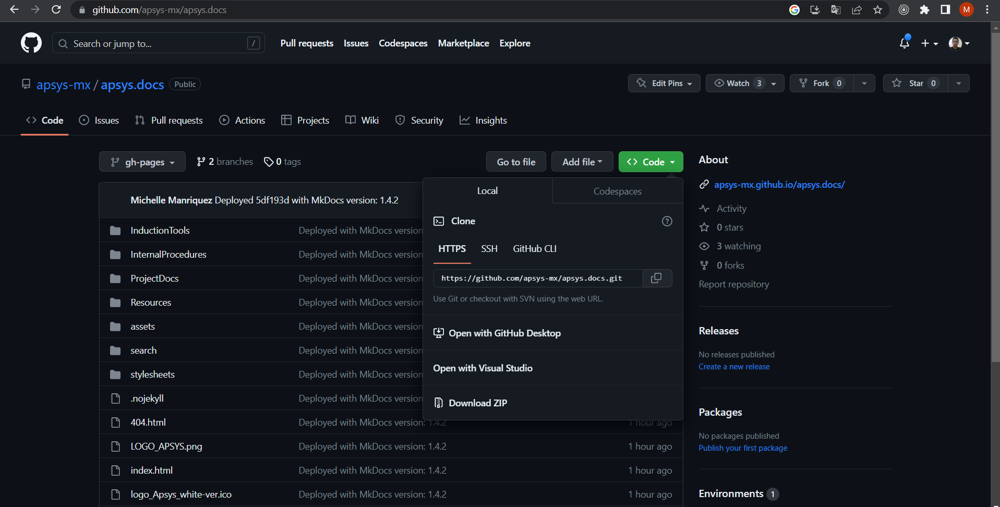

## Preguntas Frecuentes
### **¿Como accedo a un repositorio?**
Se debe pedir asistencia de cualquiera de los team-leaders de nuestro equipo Apsys, para que se te conceda el acceso a un repositorio en GitHub.

### **¿Como creo una copia (clon), de un repositorio en una carpeta de mi PC?**
Para realizar esto revisa que tengas instalado el software TortoiseGit, desde la pgina de GitHub debemos ir a donde se encuentra nuestro repositorio y dar click en el bóton *<> Code*, el cual se caracteriza por ser de color verde, se desplegara una pequeña ventana y en esta daremos click en el bóton de copia. 

Posteriormente debes ubicarte en la carpeta donde se realizara la copia. Click derecho dentro de la carpeta y seleccionamos la opción *TortoiseGit*, posteriormente damos click en *Git Clone...*, pegamos la ruta que tenemos en el porta papeles. Click en **Ok** y esperamos a que se realice la copia.