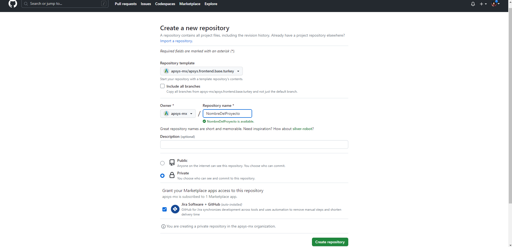
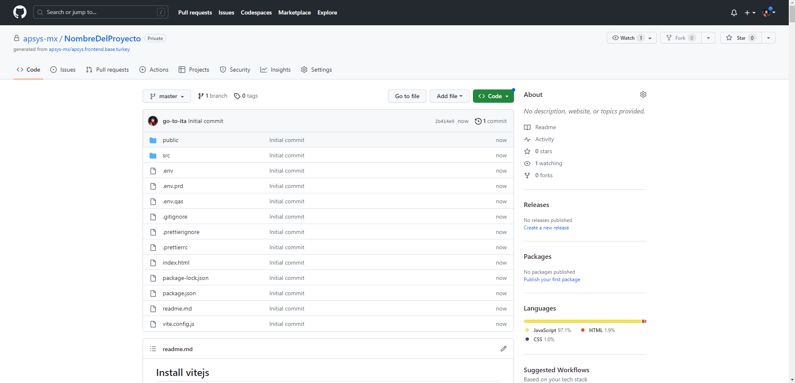

# Crear nuevo proyecto / repositorio

En el apartado de Plantilla de repositorio selecciona la opción apsys-mx/apsys.frontend.base.turkey Esta es la plantilla base que Apsys generó con la configuración de tecnologías necesarias para inicializar un proyecto.

- Selecciona la opción de Repositorio Privado y finaliza el proceso seleccionando el botón `Crear repositorio`

Una vez finalizado este proceso, Github te redirigirá al proyecto creado.

## Clonar repositorio en un dispositivo local

Al abrir el proyecto, selecciona el botón Clonar y copia la ruta del proyecto.

En el explorador de archivos de tu dispositivo, ingresa a la ubicación donde deseas clonar el repositorio. Para clonar el repositorio existen varias formas de hacerlo:

- Forma manual desde la terminal de Visual Code
- Usando un programa de control de versiones, en Apsys usualmente usamos Tortoise Git.
  
  

Cambiamos o creamos el branch a devel

