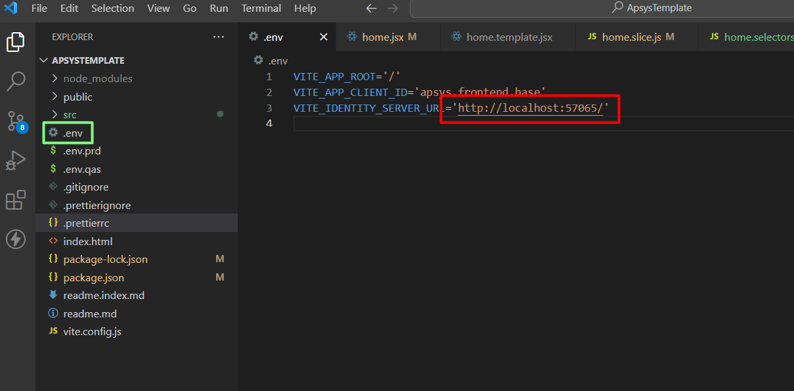

# Crear nuevo proyecto a partir de una plantilla

Igresa a tu cuenta `github`


Seleciona tu perfil e ingresa a las organizaciones


Seleciona la organización donde vas a crear el repositorio


Seleciona nuevo repositorio


Te debe apararcer la siguiente vista:


Asegurate de tener acceso a la organición de `Apsys` y selecciona la opción `apsys-mx/apsys.frontend.base.turkey`.

Esta es la plantilla base que Apsys generó con la configuración de tecnologías necesarias para inicializar un proyecto.

- Sí no cuentas con el acceso al repositorio, deberas solicitarlo al administrador.


- Agrega el nombre del proyecto, selecciona la opción de Repositorio Privado y finaliza el proceso seleccionando el botón `Crear repositorio`

  

Una vez finalizado este proceso, Github te redirigirá al proyecto creado.


## Clonar repositorio en un dispositivo local

Al abrir el proyecto, selecciona el botón Clonar y copia la ruta del proyecto.


En el explorador de archivos de tu dispositivo, ingresa a la ubicación donde deseas clonar el repositorio. Para clonar el repositorio existen varias formas de hacerlo:

- Forma manual desde la terminal.

Ubica la ruta de tu carperta donde quieres clonar el repositorio e ingresa el siguiente comando:

`git clone`

Por ultimo, pega la ruta de git, del repositorio que quieres clonar.


- Usando un programa de control de versiones.

En Apsys usualmente usamos Tortoise Git.


Cunado termine de clonarce e repositorio debe aparcer una carpeta donde se guardo.


Cambiamos o creamos el branch a devel


Revisamos la versión de node que tengamos instalas, abrimos una consola como administrador.
`nvm list`


Utilizamos la 18.13.0, si no la tenemos la instalamos.

`nvm use 18.16.0` o instalamos `nvm install 18.13.0`


Abrimos el protecto y abrimos la consola y comenzamos cons instalar los paquetes:

Ahora ejecutamos el proyecto con `npm install`


Inicializamos el proyecto:


Nos debe de aparecer la vista de inicio ingresamos ala plataforma:


Si nos aparece este error debemos de inicializar el usuario:


Ingresamos el postman:


-agregamos la siguiente ruta:
`http://localhost:57065/clients`

-Indicamos que sea un método post

-Agregamos lo siguiente en el body:

```ruby linenums="1"

{
   "ClientId":"apsys.frontend.base",
   "ClientName":"SIT Alpunto Web Application",
   "AllowedGrantTypes":[
      "implicit"
   ],
   "AllowAccessTokensViaBrowser":true,
   "AlwaysIncludeUserClaimsInIdToken":true,
   "AllowedCorsOrigins":[
        "http://localhost:5173",
        "http://127.0.0.1:5173"
   ],
   "RedirectUris":[
        "http://localhost:5173/callback",
        "http://127.0.0.1:5173/callback"
   ],
   "PostLogoutRedirectUris":[
        "http://localhost:5173",
        "http://127.0.0.1:5173"
   ],
   "AllowedScopes":[
        "openid",
        "profile",
        "userprofile"
   ],
   "RequireConsent":false,
   "ClientSecrets":[
      {
         "value":"8bzLMAwmmlPbMWSeXmMp8qOo3yKhPCN85Ws28Qswhe8="
      }
   ]
}

```

-Ingresar clientId el id de tu proyecto del front:


-En AllowedCorsOrigins, PostLogoutRedirectUris agregamos la ruta del front, y para RedirectUris asignamos a la ruta agregando `/callback`


-Confirmamos que estén todos los campos como se ve en la imagen y para finalizar enviamos la petición y nos debe dar una repuesta ok:


-
