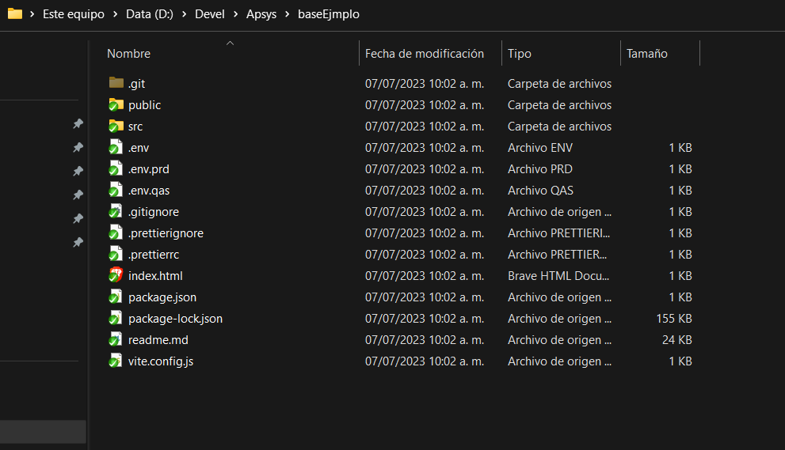

# Crear nuevo proyecto a partir de una plantilla

Igresa a tu cuenta `github`

Seleciona tu perfil e ingresa a las organizaciones

Seleciona la organización donde vas a crear el repositorio

Seleciona nuevo repositorio

Te debe apararcer la siguiente vista:

Asegurate de tener acceso a la organición de `Apsys` y selecciona la opción `apsys-mx/apsys.frontend.base.turkey`.

Esta es la plantilla base que Apsys generó con la configuración de tecnologías necesarias para inicializar un proyecto.

- Sí no cuentas con el acceso al repositorio, deberas solicitarlo al administrador.

- Agrega el nombre del proyecto, selecciona la opción de Repositorio Privado y finaliza el proceso seleccionando el botón `Crear repositorio`

  

Una vez finalizado este proceso, Github te redirigirá al proyecto creado.

## Clonar repositorio en un dispositivo local

Al abrir el proyecto, selecciona el botón Clonar y copia la ruta del proyecto.

En el explorador de archivos de tu dispositivo, ingresa a la ubicación donde deseas clonar el repositorio. Para clonar el repositorio existen varias formas de hacerlo:

- Forma manual desde la terminal.

Ubica la ruta de tu carperta donde quieres clonar el repositorio e ingresa el siguiente comando:

`git clone`

Por ultimo, pega la ruta de git, del repositorio que quieres clonar.

- Usando un programa de control de versiones.

En Apsys usualmente usamos Tortoise Git.

Cunado termine de clonarce e repositorio debe aparcer una carpeta donde se guardo.

Cambiamos o creamos el branch a devel

