# Creación de un Indice

Si creaste tu plantilla, a partir del repositorio `apsys-mx/apsys.frontend.base.turkey`, asegúrate de tener estas carpetas para poder generar el index.

- common
- dataGrid
- filters

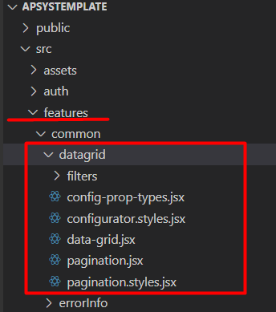

Abre la consola de visual:

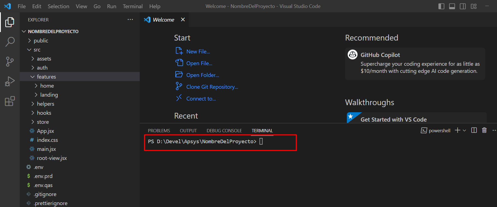

Instala los siguientes paquetes en caso de no esten instalados para confirmar verifica en el a

- Install moment

```ruby linenums="1"
npm install moment
```

- Install uuidv4

```ruby linenums="1"
npm install uuidv4
```

- Install react-select

```ruby linenums="1"
npm install react-select
```

- Install react-date-range

```ruby linenums="1"
npm install react-date-range
```

#### **Archivo endpoint**

Conecta el backend con el frontend, este proceso es diferente de acuerdo con el proyecto.

Para comprobar si el back está conectado con el front entra a la carpeta `store` y ahí debe de haber un archivo donde se configura la URL donde nos vamos a conectar al back.

- 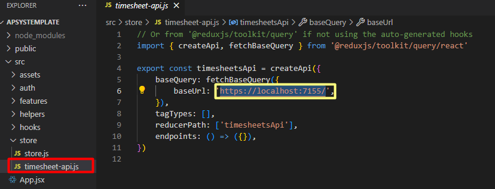

Comprobamos si la URL corresponde con la del back:

- 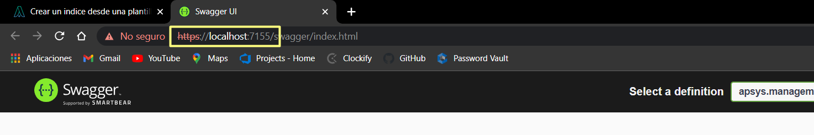

## Configuración del api Slice

Para obtener la información del index se debe generar un endpoint para realizar la petición de back.

Si no existe el archivo donde se configuran los endpoints, crea uno para comenzar a crear los métodos donde vamos a obtener la información del back y los catálogos para los filtros.

Creada a partir del módulo a trabajar, para este ejemplo seria: => `home.endPoints.js`

- 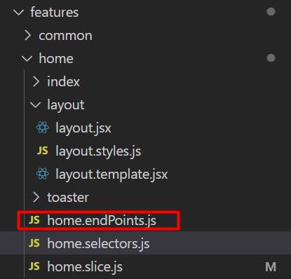

Estructura del endpoint para obtener la información aplicando paginado, filtros y ordenamiento.

- Especificamos por la columna se va a ordenar la información. En el ejemplo indicamos => `CreationDate`
- Adicional se agrega un endpoint para obtener la lista de catálogo para aplicar en los filtros con el nombre `getCatalogs`

```ruby linenums="1"
import { pokemonApi } from '../../store/timesheet-api'
export const pokemonEndPoint = pokemonApi.injectEndpoints({
    endpoints: (builder) => ({
        getPokemon: builder.query({
            query(params) {
                const { sorting, pagination, filters } = params
                var { sortBy, sortDirection } = sorting
                var { pageNumber, pageSize } = pagination
                pageNumber = pageNumber ? pageNumber : 0
                pageSize = pageSize ? pageSize : 0
                sortDirection = sortDirection && sortDirection.length > 0 ? sortDirection : 'desc'
                sortBy = sortBy && sortBy.length > 0 ? sortBy : 'Name'
                var url = `pokemons?sortBy=${sortBy}&sortDirection=${sortDirection}&pageNumber=${pageNumber}&pageSize=${pageSize}&${filters}`
                return {
                    url: url,
                    method: 'GET',
                }
            },
        }),
        getCatalogs: builder.query({
            query(fieldName) {
                return {
                    url: `pokemons/catalogs/${fieldName}`,
                    method: 'GET',
                }
            },
        }),
    }),
    overrideExisting: true,
})
export const { useGetPokemonQuery, useGetCatalogsQuery } = pokemonEndPoint
```

####Nota

Buscamos el archivo `filter-menu.jsx`

Validamos la ruta el metodo `useGetCatalogsQuery`, que creamos en las api validamos la ruta de importaión

- 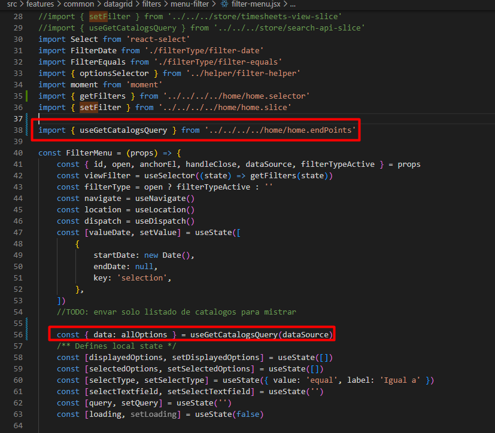

#### **Archivo Slice **

-El achivo Slice es aquel donde se encuentra la configuración del initialState: La cual contiene paginación, ordenamiento y filtros.

- El listado de reducers: Para la actualización de initialState.

Si no existe el archivo slice, crea uno para configurar el initialState.

- 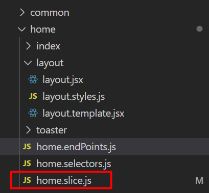

-En caso de que exista agregar los métodos faltantes.

```ruby linenums="1"

import { createSlice } from '@reduxjs/toolkit'

const defaultToasterState = {
	open: false,
	message: '',
	severity: 'info',
}

const initialState = {

	pagination: {
		rowsCount: 0,
		rowsPerPage: 20,
		page: 0,
	},
	sorting: {
		sortBy: '',
		sortDirection: '',
	},

	filters: '',
}


export const homeSlice = createSlice({
	name: 'homeSlice',
	initialState,
	reducers: {
		setPageNumber: (state, action) => {
			state.pagination.page = action.payload
		},
		setPageSize: (state, action) => {
			state.pagination.rowsPerPage = action.payload
		},
		setSorting: (state, action) => {
			state.sorting.sortBy = action.payload.sortBy
			state.sorting.sortDirection = action.payload.sortDirection
		},
		setFilter: (state, action) => {
			state.filters = action.payload
		},

	},
})

export const {
	setTitle,
	setToasterState,
	setPageNumber,
	setPageSize,
	setSorting,
	setFilter,

} = homeSlice.actions
export default homeSlice.reducer
```

#### **Archivo Selectors **

- Archivos que contenga los Selectors: Donde obtendremos la información initialState

- 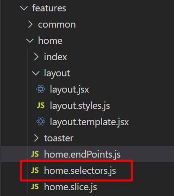

- Si no existe el archivo selectors, crea uno y agrega los métodos faltantes

```ruby linenums="1"
import { createSelector } from 'reselect'

const getState = (state) => (state = state.homeSlice)


const getViewState = createSelector(getState, (state) => {
	return state
})

const getPagination = createSelector(getViewState, (state) => {
	return state.pagination
})
const getSorting = createSelector(getViewState, (state) => {
	return state.sorting
})

const getFilters = createSelector(getViewState, (state) => {
	return state.filters
})

export {  getPagination, getSorting, getFilters, getViewState }
```

### **Creación de la tabla index **

Para generar la tabla, es necesario revisar si contamos con los siguientes archivos y que contenga la siguiente información:

### **Crear configuración de tabla**

Crear el archivo `configurationTable.jsx`

- 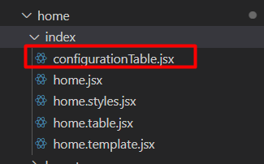

Este archivo contiene la confirmación de la tabla, aquí indicamos las columnas que queremos que aparecen en la tabla:
|

```ruby linenums="1"
export const defaultTableConfiguration = [
    {
        title: 'Pokemon', //=>Nombre de la columna
        sortable: true, //=>Si aplicará ordenmiento en la columna
        dataSource: 'name', //=>Nombre que regrea el back
        isActiveFilter: true, //=>Si aplicará filtro en la columna
        filterType: 'text', //=>>El tipo de filtro
    },
    {
        title: 'Codigo',
        sortable: true,
        dataSource: 'code',
        isActiveFilter: true,
        filterType: 'text',
    },
    {
        title: 'Fecha de creacion',
        sortable: true,
        dataSource: 'creationDate',
        isActiveFilter: true,
        filterType: 'date',
    },

]
```

#### **Implementar DataGrid **

Generamos o buscamos los siguientes archivos `home.jsx y home.template.jsx`donde emplementaremos la tabla:

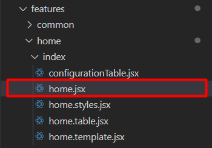

En este documento importarás la configuración anterior de la tabla, así como el archivo de datagrid y el paginado ya configurado en el proyecto base.

- Es necesario llamar los selectors para obtener el paginado, ordenamiento y filtros
- Llamar el endpoint que realizamos para obtener la información del back mandando la información que obtenemos de los selectores del initialState.
- Este endpoint nos regresará un isLoading, isError y una data que contendrá la lista de Items, total, pageSize y pageNumber.
- Generaremos métodos para llamar las acciones que permitan modificar el paginado y ordenamiento:

```ruby linenums="1"
import React from 'react'
/** Import templates */
import DesktopTemplate from './home.template'
import { setPageNumber, setPageSize, setSorting } from '../home.slice'
import { useDispatch, useSelector } from 'react-redux'
import * as selectors from '../home.selector'
import { useGetPokemonQuery } from '../home.endPoints'
/** Home component */
const Home = () => {
    const dispatch = useDispatch()
    const viewPaginationState = useSelector((state) => selectors.getPagination(state))
    const viewSortingState = useSelector((state) => selectors.getSorting(state))
    const viewFilter = useSelector((state) => selectors.getFilters(state))
    const { data, isLoading, isError, error } = useGetPokemonQuery({
        pagination: {
            pageNumber: viewPaginationState.page,
            pageSize: viewPaginationState.rowsPerPage,
        },
        sorting: {
            sortBy: viewSortingState.sortBy,
            sortDirection: viewSortingState.sortDirection,
        },
        filters: viewFilter ? viewFilter : '',
    })
    console.log('data', data)
    const handleChangePage = (pageNumber) => {
        dispatch(setPageNumber(pageNumber))
    }
    const handleChangeRowsPerPage = (pageSize) => {
        dispatch(setPageSize(pageSize))
    }
    //:::::::::::::::::(Sorting):::::::::::::::::::::::::://
    const onchangeSorting = (sort, direction) => {
        dispatch(setSorting({ sortBy: sort, sortDirection: direction }))
    }
    return (
        <div>
            {data?.items?.length > 0 && (
                <DesktopTemplate
                    data={data}
                    onChangePage={handleChangePage}
                    handleChangeRowsPerPage={handleChangeRowsPerPage}
                    onchangeSorting={onchangeSorting}
                    sorting={viewSortingState}
                />
            )}
        </div>
    )
}
export default Home

```

Podemos confirmar que recibimos información de back mandando a consola él data y podemos ver qué información revivimos en el navegador:

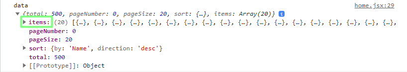

La lista de item podemos ver la información que recibimos y aquí podemos determinar que información queremos que aparezca y podemos agregar los campos en la configuración de la tabla:

Ahora creamos un documento `home.table.jsx`

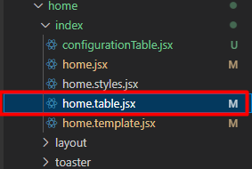

- Empezamos a importar la tabla
- Se pasa la configuración de la tabla, tableConfig.
- Se indica la columna que quieres modificar y el cambio que quieras realizar
- Pasamos la información que se resive de las props

```ruby linenums="1"
import React, { useEffect, useState } from 'react'
import propTypes from 'prop-types'
//Templates
import DataGrid from '../../common/datagrid/data-grid'
import moment from 'moment'
//
const HomeTable = ({ items, tableConfig, onchangeSorting, sortBy, sortDirection }) => {
    console.log(items)
    /**
     * State hook for configTable
     */
    const [localTableConfig, setLocalTableConfig] = useState([])
    useEffect(() => {
        if (tableConfig) {
            var local = tableConfig.map((config) => {
                return { ...config }
            })
            setLocalTableConfig(local)
        }
    }, [tableConfig])
    /**
     * Get the header configuration
     */
    const enhancedConfiguration = localTableConfig.map((config) => {
        switch (config.dataSource) {
            case 'startDate':
                config.onRenderProperty = (item) => {
                    return moment(item.startDate).format('DD/MM/YYYY')
                }
                break
            case 'endDate':
                config.onRenderProperty = (item) => {
                    return moment(item.endDate).format('DD/MM/YYYY')
                }
                break
            default:
        }
        return config
    })
    return (
        <div>
            <DataGrid
                headers={enhancedConfiguration}
                data={items}
                onchangeSorting={onchangeSorting}
                sortBy={sortBy}
                sortDirection={sortDirection}
            />
        </div>
    )
}
HomeTable.propTypes = {
    items: propTypes.array,
    onchangeSorting: propTypes.func,
    handleChangePage: propTypes.func,
    handleChangeRowsPerPage: propTypes.func,
}
HomeTable.defultProps = {
    items: [],
    onchangeSorting: () => console.warn('No [onchangeSorting] CallBack defined'),
    handleChangePage: () => console.warn('No[handle change page] Callback defined'),
    handleChangeRowsPerPage: () => console.warn('No[handle change rows per page] Callback defined'),
}
export default HomeTable

```

Vamos al archivo `home.template.jsx` y agregamos el siguiente código donde el metodo para crear la tabla y el paginado:

```ruby linenums="1"
import React from 'react'
import HomeTable from './home.table'
import Pagination from '../../../features/common/datagrid/pagination'
import { defaultTableConfiguration } from './configurationTable'
/** Home component */
const HomeTemplate = (props) => {
    const { data, onChangePage, handleChangeRowsPerPage, onchangeSorting, sorting } = props
    return (
        <div>
            <HomeTable
                tableConfig={defaultTableConfiguration}
                {...data}
                onchangeSorting={onchangeSorting}
                sortBy={
                    sorting.sortBy && sorting.sortBy.length > 0 ? sorting.sortBy : 'projectName'
                }
                sortDirection={
                    sorting.sortDirection && sorting.sortDirection.length > 0
                        ? sorting.sortDirection
                        : 'desc'
                }
            />
            <Pagination
                pagination={data}
                onPageChange={onChangePage}
                onRowsPerPageChange={handleChangeRowsPerPage}
            />
        </div>
    )
}
export default HomeTemplate
```

Debe de aparecer la tabla y los filtros:


