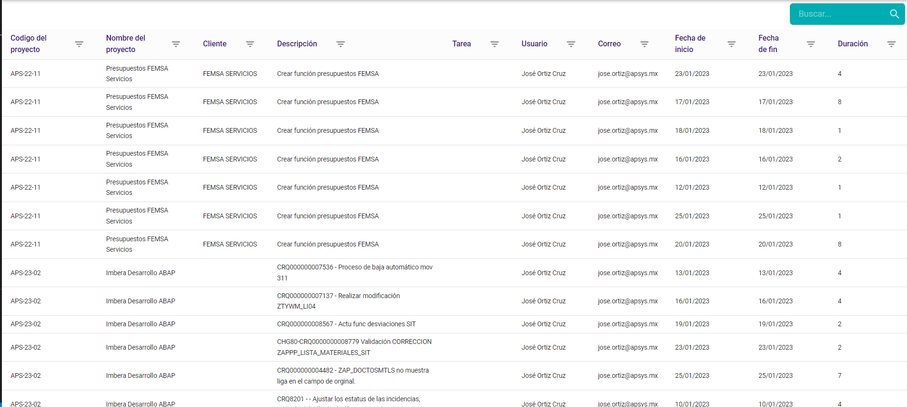
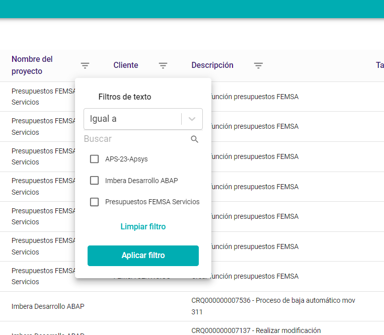

# Creación de un Indice

Instala los siguientes paquetes que contendrán lo requerido para el funcionamiento del Índice.

- Install moment

```ruby linenums="1"
npm install moment
```

- Install uuidv4

```ruby linenums="1"
npm install uuidv4
```

- Install react-select

```ruby linenums="1"
npm install react-select
```

- Install react-date-range

```ruby linenums="1"
npm install react-date-range
```

#### **Archivo endpoint**

Conecta el backend con el frontend, este proceso es diferente de acuerdo al proyecto.

Para obtener la información del index se debe generar un endpoint para realizar la petición de back.

Ejemplo de la estructura del endpoint al back aplicando paginado, ordenamiento y filtros:

```ruby linenums="1"
getTimesheets: builder.query({
			query(params) {
				const { sorting, pagination, filters } = params
				var { sortBy, sortDirection } = sorting
				var { pageNumber, pageSize } = pagination
				pageNumber = pageNumber ? pageNumber : 0
				pageSize = pageSize ? pageSize : 0
				sortDirection = sortDirection && sortDirection.length > 0 ? sortDirection : 'desc'
				sortBy = sortBy && sortBy.length > 0 ? sortBy : 'projectName'
				var url = `Timesheets?sortBy=${sortBy}&sortDirection=${sortDirection}&pageNumber=${pageNumber}&pageSize=${pageSize}&${filters}`
				return {
					url: url,
					method: 'GET',
				}
			},
		}),
```

Agregamos un endpoint para obtener la lista de catálogo para aplicar en los filtros con el nombre `getCatalogs`:

```ruby linenums="1"
getCatalogs: builder.query({
			query(fieldName) {
				return {
					url: `Timesheets/catalogs/${fieldName}`,
					method: 'GET',
				}
			},
		}),
```

### **Crear configuración de tabla**

Crear el archivo 'configurationTable.jsx'

Este archivo contiene la confirmación de las columnas que se mostraran en la tabla:

```ruby linenums="1"
export const defaultTableConfigurationTimeSheets = [
    {
       title: 'Codigo del proyecto', //=>Nombre de la columna
		sortable: true, //=>Si aplicará ordenmiento en la columna
		dataSource: 'projectCode', //=>Nombre que regrea el back
		isActiveFilter: true, //=>Si aplicará filtro en la columna
		filterType: 'text', //=>>El tipo de filtro
    },
        {
        title: 'Fecha de inicio',
        sortable: true,
        dataSource: 'startDate',
        isActiveFilter: true,
        filterType: 'date',
    },
        {
        title: 'Duración',
        sortable: true,
        dataSource: 'duration',
        isActiveFilter: true,
        filterType: 'numeric',
    },
]

```

Al ser un repositorio generado a partir de una base, notaremos que ya existen algunos archivos y carpetas en el proyecto.
Identifica el datagrid dentro de la siguiente ruta src > features > common > datagrid  
en esa ubicación también podrás encontrar los documentos base de filtros y de buscador.

### **Creación de la tabla index **

Para generar la tabla, es necesario revisar si contamos con los siguientes archivos y que contenga la siguiente información:

#### **Archivo Slice **

- un archivo donde se encuentre la configuración del initialState: donde contendrá paginación, sorting, filtros.
- El listado de reducers: Para la actualización de initialState.

```ruby linenums="1"

import { createSlice } from '@reduxjs/toolkit'

const defaultToasterState = {
	open: false,
	message: '',
	severity: 'info',
}

const initialState = {

	pagination: {
		rowsCount: 0,
		rowsPerPage: 20,
		page: 0,
	},
	sorting: {
		sortBy: '',
		sortDirection: '',
	},

	filters: '',
}

export const homeSlice = createSlice({
	name: 'homeSlice',
	initialState,
	reducers: {
		setPageNumber: (state, action) => {
			state.pagination.page = action.payload
		},
		setPageSize: (state, action) => {
			state.pagination.rowsPerPage = action.payload
		},
		setSorting: (state, action) => {
			state.sorting.sortBy = action.payload.sortBy
			state.sorting.sortDirection = action.payload.sortDirection
		},
		setFilter: (state, action) => {
			state.filters = action.payload
		},

	},
})

export const {
	setTitle,
	setToasterState,
	setPageNumber,
	setPageSize,
	setSorting,
	setFilter,

} = homeSlice.actions
export default homeSlice.reducer
```

#### **Archivo Selectors **

- Archivos que contenga los Selectors: Donde obtendremos la información initialState

```ruby linenums="1"
import { createSelector } from 'reselect'

const getState = (state) => (state = state.homeSlice)


const getViewState = createSelector(getState, (state) => {
	return state
})

const getPagination = createSelector(getViewState, (state) => {
	return state.pagination
})
const getSorting = createSelector(getViewState, (state) => {
	return state.sorting
})

const getFilters = createSelector(getViewState, (state) => {
	return state.filters
})

export {  getPagination, getSorting, getFilters, getViewState }
```

#### **Implementar DataGrid **

Genera un nuevo archivo con el nombre de la tabla, en este documento importarás la configuración anterior de la tabla, así como el archivo de datagrid ya configurado en el proyecto base.

- Es nesario llamar los selectors para obtener el paginado, ordenamiento y filtros:

```ruby linenums="1"
	const viewPaginationState = useSelector((state) => selectors.getPagination(state))
	const viewSortingState = useSelector((state) => selectors.getSorting(state))
	const viewFilter = useSelector((state) => selectors.getFilters(state))
```

- LLamar el endpoint que realizamos para obtener la información del back mandando la información que obtenemos de los selectores del initialState.
- Este endpoint nos regresará un isLoading, isError y una data que contendrá la lista de Items, total, pageSize y pageNumber.

```ruby linenums="1"
const {
		data: timeSheetsResponse,
		isLoading,
		isError,
		error,
	} = useGetTimesheetsQuery({
		pagination: {
			pageNumber: viewPaginationState.page,
			pageSize: viewPaginationState.rowsPerPage,
		},
		sorting: {
			sortBy: viewSortingState.sortBy,
			sortDirection: viewSortingState.sortDirection,
		},
		filters: viewFilter ? viewFilter : '',
	})
```

Generaremos métodos para llamar las acciones que permitan modificar el paginado y ordenamiento:

```ruby linenums="1"
 	const handleChangePage = (pageNumber) => {
		dispatch(setPageNumber(pageNumber))
	}
	const handleChangeRowsPerPage = (pageSize) => {
		dispatch(setPageSize(pageSize))
	}
	//:::::::::::::::::::::::::::::::::::::::::::::::::::://
	//:::::::::::::::::(Sorting):::::::::::::::::::::::::://
	const onchangeSorting = (sort, direction) => {
		dispatch(setSorting({ sortBy: sort, sortDirection: direction }))
	}
	//:::::::::::::::::::::::::::::::::::::::::::::::::::://
```

Si quieres realizar alguna modificación de las columnas puedes realizar la siguiente configuración:

- Se pasa la configuración de la tabla, tableConfig.

- Se indica la tabla que quieres modificar y el cambio que quieras realizar

````ruby linenums="1"
const [localTableConfig, setLocalTableConfig] = useState([])
	useEffect(() => {
		if (tableConfig) {
			var local = tableConfig.map((config) => {
				return { ...config }
			})
			setLocalTableConfig(local)
		}
	}, [tableConfig])
	/**
	 * Get the header configuration
	 */
	const enhancedConfiguration = localTableConfig.map((config) => {
		switch (config.dataSource) {
			case 'startDate':
				config.onRenderProperty = (item) => {
					return moment(item.startDate).format('DD/MM/YYYY')
				}
				break
			case 'endDate':
				config.onRenderProperty = (item) => {
					return moment(item.endDate).format('DD/MM/YYYY')
				}
				break
			default:
		}
		return config
	})
    ```
````

Ahora llamamos la tabla y le pasamos los valores correspondientes:

```ruby linenums="1"
	<Box>

			<DataGrid
				headers={enhancedConfiguration}
				data={data.items}
				onchangeSorting={onchangeSorting}
				sortBy={sortBy}
				sortDirection={sortDirection}
			/>
			<Pagination
				pagination={data}
				onPageChange={handleChangePage}
				onRowsPerPageChange={handleChangeRowsPerPage}
			/>
		</Box>

```




