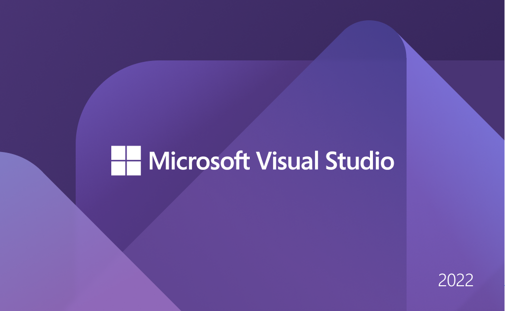

# Guia de instalacíon y primeros paso de las plantillas Apsys Templates

## *Guia para instalar y usar una plantilla en backend.*

### **Instalación**

- ***Instalación desde el Marketplace***

Para poder realizar la instalación de la nueva plantilla debemos lanzar nuestra aplicación de **Visual Studio**.



Posteriormente procedemos a darle click a continuar sin código(o *continue without code* si es que tienes la versión en ingles). 


Estaremos en la pantalla del área de trabajo de **Visual Studio,** ahora nos dirigiremos a la pestaña de 


Se desplegara un pequeño menú del cual daremos click en el Administrador de extensiones. Esto nos mostrara una ventana donde veremos los diferentes tipos de extensiones, las instaladas y las disponibles para poder descargarse. Procederemos a dar click en **Visual Studio Marketplace,** y en el buscador escribiremos “apsys”, como se indica en la imagen.


Deberemos descargar el “ApsysBaseTemplate” y nos aparecerá un mensaje emergente, el cual indicara que la instalación se llevara a cabo posterior a cerrar **Visual Studio.**


Para continuar con la instalación sera necesario cerrar por completo **Visual Studio**, y de manera automática se lanzara el instalador.


Nos preguntara si queremos modificar nuestro software y deberemos indicar que si con el botón “Modificar”(o *Modify* si tienes la versión en ingles).


Cuando se halla finalizado la instalación al iniciar nuevamente **Visual Studio** y crear un nuevo proyecto, en nuestras plantillas aparecerá la nueva plantilla.


Y aunque esta manera de integrar la nueva plantilla es muy buena, no es la única. Existe otra forma igualmente efectiva para integrar nuevas plantillas a nuestro ambiente de **Visual Studio**, la que consideramos como la forma “manual”, se describe a continuación:

- ***Instalación Manual***

Para llevar a cabo esta manera de integrar la nueva plantilla, primero deberemos contar con el archivo .zip generado por **Visual Studio** al exportar la plantilla.


Dicho archivo deberemos copiarlo en la siguiente ruta, evidentemente esta ruta se tendrá que completar con lo correspondiente para cada equipo (PC).

> Si tienes mas de un disco duro, recuerda que deberás buscar la ruta en el disco donde se tiene instalado **Visual Studio**.
> 

```powershell
*…Documentos\Visual Studio 2022\Templates\ProjectTemplates*
```

Ya que nuestro archivo se encuentre en la ruta ya mencionada se realiza la extracción de archivos en la misma carpeta. De tal manera que tendremos una nueva carpeta con el nombre de nuestra  nueva plantilla.


Si hiciste los pasos como se indico deberá de aparecer nuestra nueva plantilla en al crear un nuevo proyecto


### *Uso de la Plantilla*

Para usar una nueva plantilla, al abrir **Visual Studio** nos dirigimos a crear un nuevo proyecto:


y en el buscador buscamos la plantilla ya instalada: 


al seleccionarla nos creara el nuevo proyecto y nos pedirá el nombre y algunos datos para donde ubicar el nuevo proyecto.


al darle en crear se generara la base del nuevo proyecto: 


## *Guia para instalar y usar una plantilla en frontend*