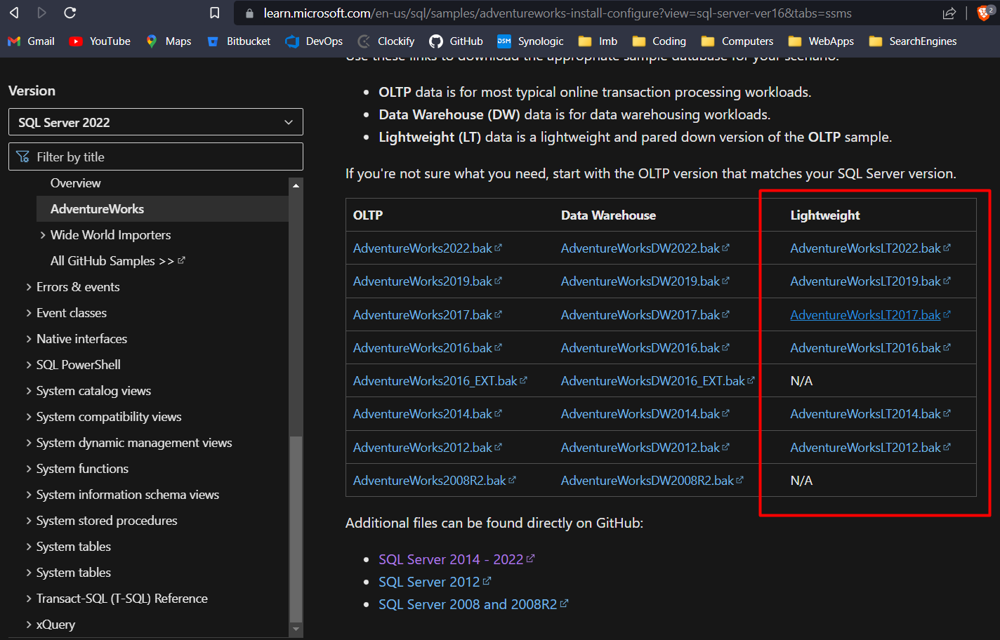
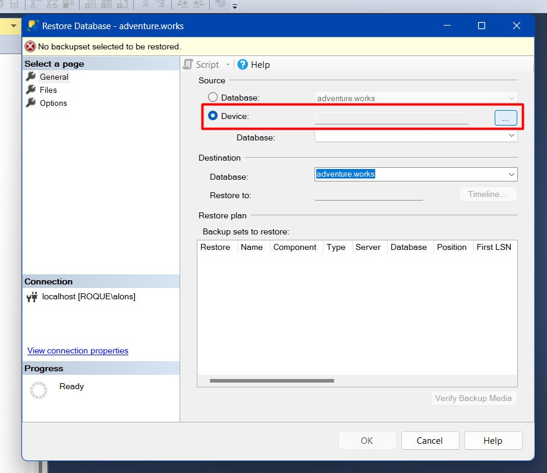
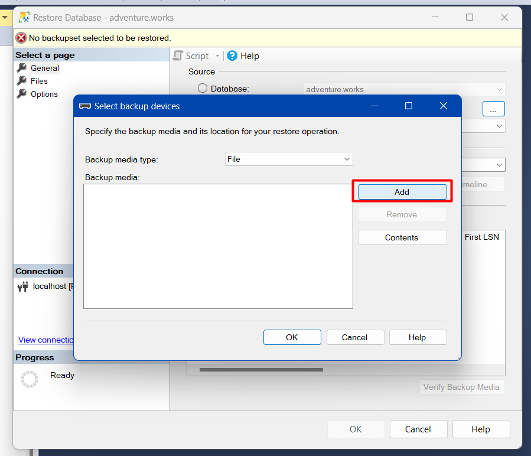
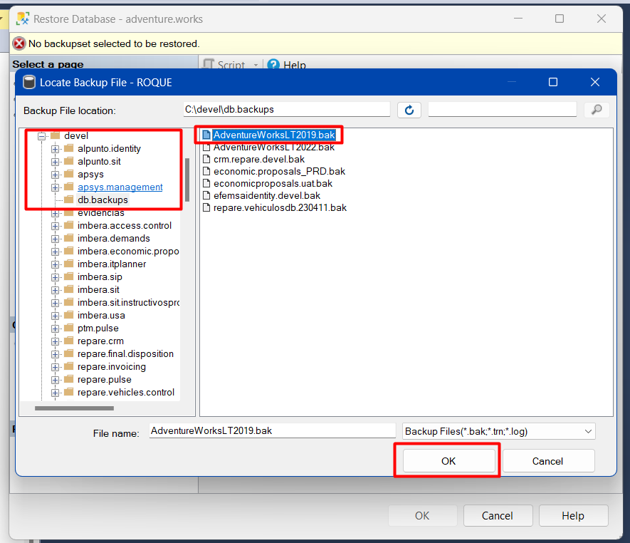
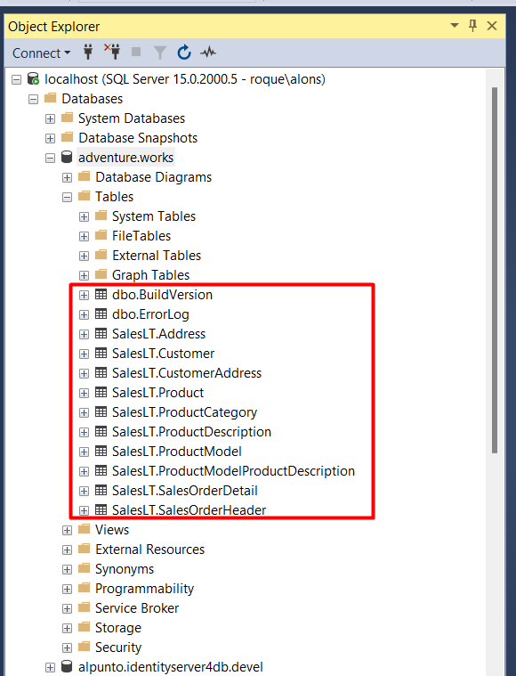
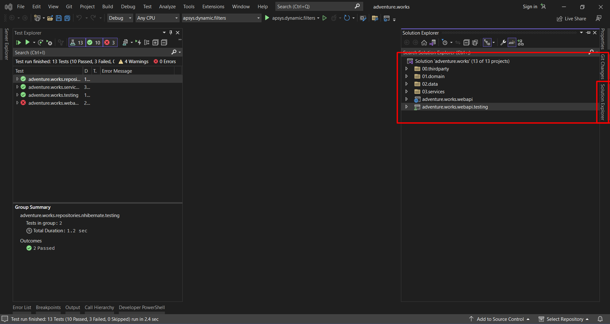
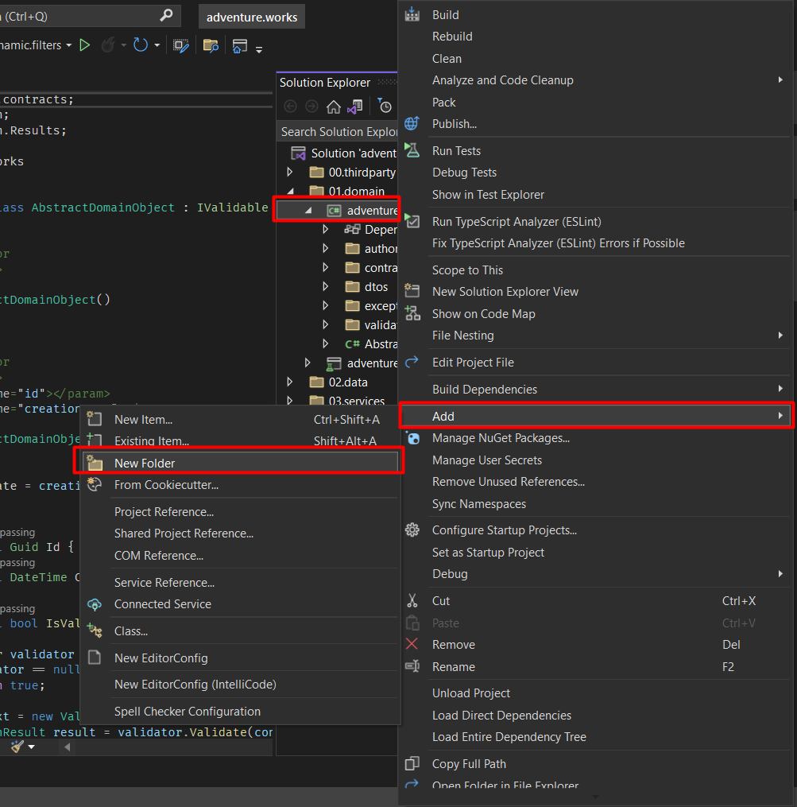
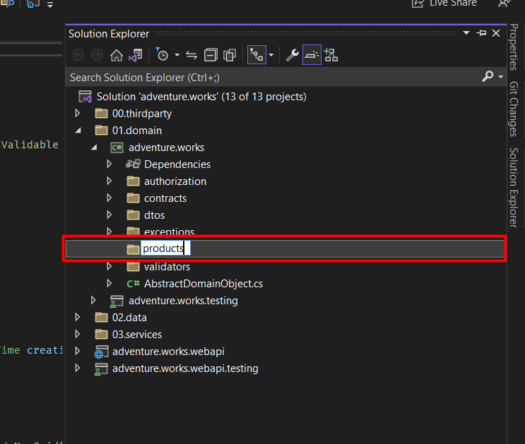
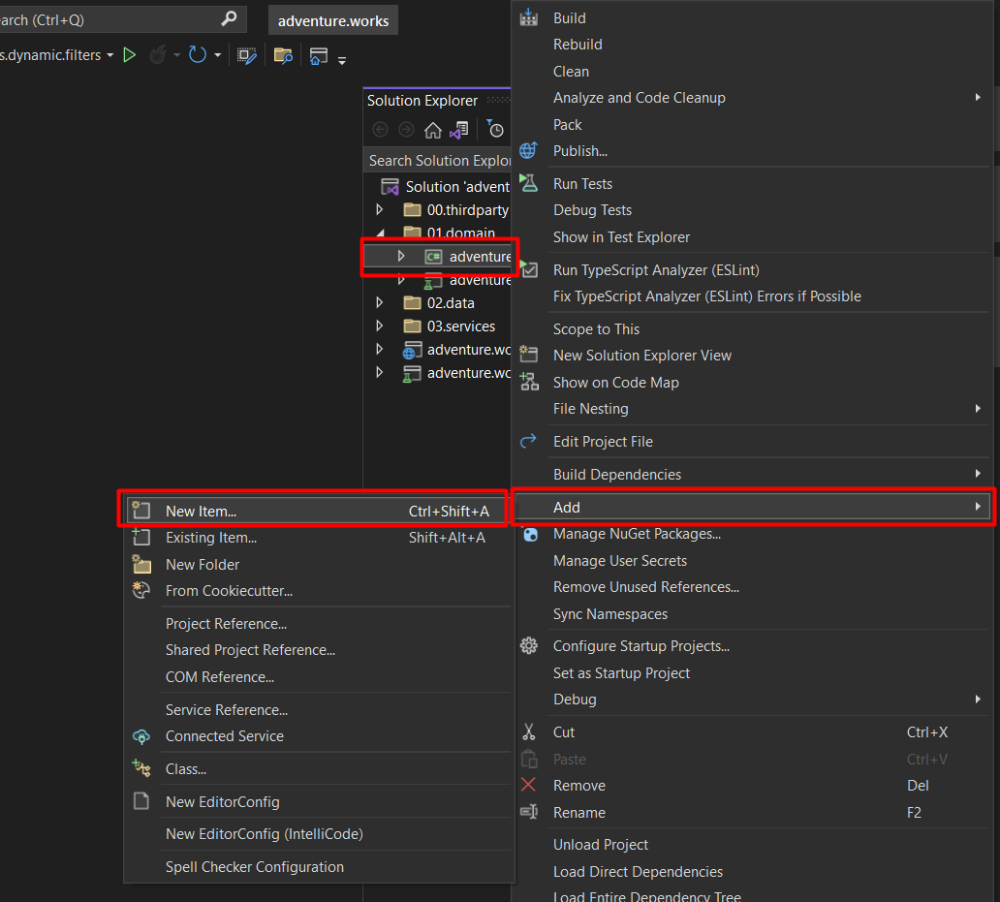

## ** 1er proyecto con una plantilla**

Dentro de Apsys y como busqueda de la mejora continua, hemos creado algunas plantillas, esto con el fiel objetivo de estandarizar nuestros procesos para el desarrollo del software.
Y como primer ejercicio tendras la tarea de generar un indice básico utilizando una plantilla y siguiendo las instrucciones que encontraras a continuación.

### **Configuración**

Deberas abrir el software Visual Studio, usea la plantilla de Apsys que instalamos previamente y con ella crearemos un nuevo
proyecto llamado adventure.works

.png)

Tambien iniciaremos el Microsoft SQL Management Studio y crearemos una nueva base de datos con el nombre *adventure.works*.


.png)

Para poder restaurar la base de datos para nuestro proyecto, descargaremos el respaldo de AdventureWorks de Microsoft 
[Aqui.](https://learn.microsoft.com/en-us/sql/samples/adventureworks-install-configure?view=sql-server-ver16&tabs=ssms "Aqui")

!!! nota
    Es importante que descargue el respaldo adecuada para la versión de Microsoft SQL Management Studio que se tenga instalada
    en tu equipo.



Restauramos el respaldo a la base de datos que creamos.






La selección de la ruta depende de la carpeta en donde se guardo el respaldo de la base de datos que descargaste, en este ejemplo se guardo en la siguiente ruta:

```
C:\devel\db.backup
```



Posteriormente verificamos que la base de datos contenga las siguientes tablas:



Hasta este punto hemos finalizado con la configuración para la base de datos de nuestro proyecto por lo que seguiremos trabajando nuevamente en Visual Studio.

Crearemos un *endpoint* que obtenga la lista de productos, para implementar esta funcionalidad revisemos la estructura de nuestra solución en Visual Studio.



Nos situamos en el explorador de la solución donde se denotan cuatro capas **dominio**(*01.domain*), **datos**(*02.data*), **servicios**(*03.services*), **webapi**(*webapi*). Se deduce que cada uno tiene diferente funcion dentro del proyecto global que estamos desarrollando. 

!!! Nota
    Notese que en cada capa hay un proyecto con la terminación *testing*, estos son proyectos para realizar pruebas automatizadas y que son de gran importancia, pero para este tutorial no los usaremos ya que nos centraremos en poner en marcha nuestro primer proyecto.

La primer capa (proyecto) con que trabajaremos sera el **dominio**, crearemos un folder llamado *products* que contenderá las clases que usaremos para los productos.





Como siguiente paso agregaremos las clases que usaremos para lalógica de nuestra aplicación. La primera de ellas sera la clase que va a representar un producto de la aplicación y dicha clase la nombraremos *Product*.




El codigo que colocaremos dentro de la clase creada sera el siguiente:

```ruby linenums="1"
  public class Product
    {
        public int ProductID { get; set; }
        public string Name { get; set; }
        public string ProductNumber { get; set; }
        public string Color { get; set; }
        public decimal StandardCost { get; set; }
        public decimal ListPrice { get; set; }
        public string Size { get; set; }
        public string Weight { get; set; }
        public DateTime SellStartDate { get; set; }
        public DateTime? SellEndDate { get; set; }
        public DateTime? DiscontinuedDate { get; set; }
        public bool ThumbNailPhoto { get; set; }
        public string ThumbnailPhotoFileName { get; set; }
        public Guid rowguid { get; set; }
        public DateTime ModifiedDate { get; set; }
    }
```

Por el momento solo agregaremos este bloque de codigo en la clase, ya que para este punto nuestro objetivo es configurar la conexión con nuestra base de datos.

Como siguiente paso 

