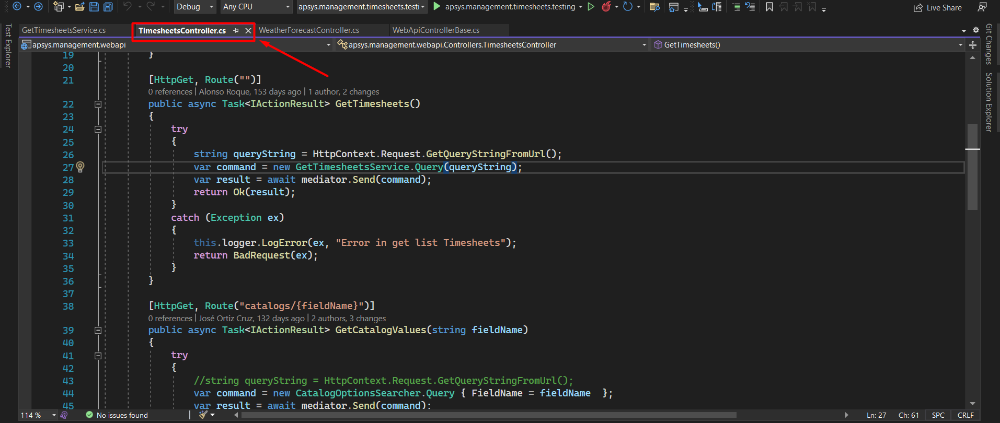
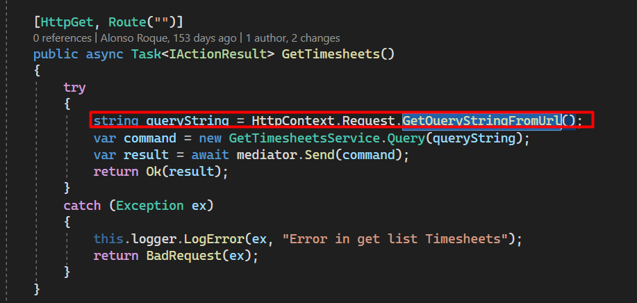

## **Backend**

Para poder llevar a cabo una implementación que implique filtros y teniendo como antecedente el uso de las plantillas que tambien se explica en esta documentación. Tomando en cuenta
que ya contamos con un indice ahora debemos generar un controlador para asi disponer de un *endpoint*, por lo que nos dirigimos a nuestro controlador que debe de corresponder al módulo
o clase del dominio que trabajaremos, para este tutorial dicha clase es *Timesheets*.



Ya dentro del controlador mencionado deberemos agregar el siguiente bloque de código:

```ruby
 [HttpGet, Route("")]
        public async Task<IActionResult> GetTimesheets()
        {
            try
            {
                string queryString = HttpContext.Request.GetQueryStringFromUrl();
                var command = new GetTimesheetsService.Query(queryString);
                var result = await mediator.Send(command);
                return Ok(result);
            }
            catch (Exception ex)
            {
                this.logger.LogError(ex, "Error in get list Timesheets");
                return BadRequest(ex);
            }
        }
```

??? warning "Importante"
    Es importante tener en cuenta que para este ejercicio se esta considerando que no existe un *endpoint* con ruta "", en caso de que ya existiera uno se debera cambiar, ya que para llevar a cabo lo comentado en esta guia debemos dejar ese *endpoint* para nuestro proceso.

Si para este punto recompilamos nuestro proyecto este arrojara errores, abordaremos linea por linea del código para entender todo lo necesario para llevar a cabo nuestro proceso.

### Query String

La primera linea corresponde al procesamiento que se le da al *query string* que se encuentra en el cuerpo de nuestra petición que se hace desde el *Frontend*.



Dicho procesamiento se realiza 


## **Frontend**

En el caso del *Frontend* y similar al apartado ya revisado(*Backend*), orientaremos este tutorial principalmente a lo que corresponde a la conexión correspondiente para obtener la información
para la funcionalidad del filtrado en un indice. Y si bien abordaremos el como se mostrara en el apartado visual solo sera a modo de recomendación. 